---
title: "机器学习辅助的中国行业ETF轮动研究"
subtitle: "弱信号治理与规格审计框架下的实证分析"
author:
  - name: "沈小川"
  - name: "董袁豪"
date: "2026-06-26"
date-format: "YYYY-MM-DD"
lang: zh
format:
  html:
    theme:
      light: [cosmo, assets/report-style.css]
      dark: [darkly, assets/report-style.css]
    toc: true
    toc-depth: 3
    toc-location: left
    toc-title: "目 录"
    number-sections: true
    number-depth: 2
    code-fold: false
    code-tools: false
    embed-resources: true
    fig-cap-location: bottom
    fig-width: 9
    fig-height: 5
    mainfont: "Noto Sans SC"
    fontsize: "16px"
bibliography: assets/references.bib
abstract: |
  本研究以中国A股市场6只宽口径行业ETF为对象，系统考察正则化机器学习方法（Ridge、LASSO、Elastic Net）在行业轮动策略中的实际作用。在低维横截面、高噪声、强共线性的约束下，机器学习的主要贡献不在于发现新的Alpha因子，而在于对多维弱信号进行稳健收缩与排序整合。研究构建了包含资产池、因子集、模型选择、训练窗口和交易规则五个层级的规格空间，通过双阶段探索与多维审计（PBO/CSCV、多墙POOS、滚动起点敏感性）完成参数收敛。在本研究样本期（2015-08至2026-06）与双边15bp交易成本假设下，最终锁定策略录得年化收益约14.6%、Sharpe约0.75、相对可交易沪深300ETF累计超额约102%。在本研究的样本与设定条件下，策略的本质更接近"带趋势过滤的行业Beta择时系统"，正则化方法在其中承担弱信号治理工具的角色。
keywords: [行业轮动, ETF, 机器学习, 正则化, Ridge回归, LASSO, 规格审计, 过拟合诊断]
---
# 机器学习辅助的中国行业ETF轮动研究

---

## 第一部分 引言与研究问题

### 1.1 研究背景

不同行业的市场表现并不同步。在经济环境、产业景气和资金偏好发生变化时，市场中的优势行业也会随之转换。行业轮动策略试图识别这种相对强弱变化，并将资金配置到表现更有可能延续的行业。

但行业轮动并不容易。金融数据噪声较大，行业表现也会随市场状态发生变化。单一动量指标可能遗漏风险、趋势和交易信息；使用过多指标，又容易出现信息重复和历史过拟合。因此，如何从多个指标中形成相对稳定的行业判断，是行业轮动研究中的核心问题。

行业ETF为研究这一问题提供了较合适的对象。它既能够代表不同产业，又比个股更容易交易和管理，适合构建中低频的行业配置策略。

### 1.2 研究问题

本文关注的核心问题是：

::: {.callout-key}
机器学习能否整合动量、趋势、风险和交易信息，改善中国行业ETF的相对排序，并形成具有一定稳定性的低频轮动策略？
:::

围绕这一问题，本文进一步考察三个方面：

第一，行业ETF的历史表现是否包含可以利用的相对强弱和趋势信息；

第二，Lasso、Ridge和Elastic Net等正则化模型，是否能够比单一动量或简单因子组合更有效地整合信息；

第三，在改变资产池、因子范围、训练窗口和交易规则后，策略结果是否仍然成立。

### 1.3 研究思路与边界

本文首先梳理行业动量、趋势跟踪和机器学习资产定价的理论基础，并说明选择行业ETF和正则化方法的原因。

在此基础上，本文建立简单的行业轮动基准策略，再使用正则化模型预测下一阶段ETF的相对表现，并根据预测结果进行排序和配置。最后，通过不同样本区间、参数设定和交易成本检验策略的稳定性。

本文的目的不是证明机器学习能够准确预测市场，也不是从大量参数中寻找历史收益最高的组合，而是评估机器学习相对于简单轮动规则是否具有稳定的增量作用。

需要说明的是，本研究的出发点最初是寻找有效的行业轮动因子。但在系统性的探索、回测与规格审计过程中，我们对机器学习在金融预测中的实际作用边界有了新的认识：机器学习的主要贡献并不在于发现某种市场尚未察觉的稳定盈利公式，而在于对高噪声、强共线的多因子信号进行稳健的收缩整合与排序——其角色被逐步限缩为"弱信号治理工具"而非"Alpha发现引擎"。这一认识转变也深刻影响了本文的叙事框架和结论表达。

---

## 目录

### 第一部分 引言与研究问题

1.1 研究背景
1.2 研究问题
1.3 研究思路与边界

### 第二部分 文献基础与理论框架

### 2.1 学术研究的演进脉络

本研究的学术脉络深度扎根于资产定价与战术配置的理论演进。从资本资产定价模型（CAPM）至今，量化资产配置研究经历了多次重大的学术演化。

#### 2.1.1 资产定价理论的起点：CAPM

资本资产定价模型（CAPM, Sharpe 1964; Lintner 1965）是资产定价理论的奠基之作。其核心观点是：**资产的预期收益仅由其市场风险（Beta）决定**，即：

$$
E(R_i) = R_f + \beta_i [E(R_m) - R_f]
$$

CAPM 简洁优美，但实证检验发现其解释力有限——市场 Beta 无法完全解释股票收益的差异。

#### 2.1.2 因子模型的诞生：从三因子到五因子

**Fama-French 三因子模型（1993）** 是资产定价领域的里程碑。研究发现，除了市场风险外，还有两个因子能显著解释股票收益：

- **规模因子（SMB）**：小盘股长期跑赢大盘股
- **价值因子（HML）**：高账面市值比（价值股）跑赢低账面市值比（成长股）

三因子模型将资产定价从“单一风险”拓展为“多因子”范式，奠定了现代因子投资的理论基础。后续研究进一步拓展为五因子模型（加入盈利因子 RMW 和投资因子 CMA）。

**核心贡献**：开启了“通过因子解释收益”的研究范式，为后续的动量因子、行业因子等研究提供了方法论框架。

#### 2.1.3 动量效应的发现

Jegadeesh & Titman（1993）发现，除了规模和价值外，**过去收益本身也是未来收益的预测因子**——这就是动量效应。这一发现无法被三因子模型解释，因此被称为“动量异象”。

#### 2.1.4 从个股到行业：行业动量的提出

Moskowitz & Grinblatt（1999）发现，个股层面的动量收益很大程度上来源于行业层面的持续性。这意味着：

- 与其研究数千只个股，不如聚焦于几十个行业
- 在Moskowitz & Grinblatt（1999）的美国样本中，行业层面的动量比个股动量更稳定

#### 2.1.5 时间序列动量与趋势跟踪

Moskowitz, Ooi & Pedersen（2012）将动量从“截面比较”拓展到“时间序列”维度，发现资产自身的历史收益具有预测能力。这为趋势跟踪策略（CTA）提供了理论依据，也启发了 ETF 轮动策略中的趋势过滤模块。

#### 2.1.6 机器学习进入资产定价

Gu, Kelly & Xiu（2020）系统比较了 Ridge、LASSO、Elastic Net、随机森林、神经网络等机器学习方法在资产定价中的表现。核心发现：

- 金融市场中存在大量微弱但有价值的预测信号
- 机器学习的主要作用是**整合这些弱信号**，而非发现新规律

这标志着资产定价研究从“寻找单个有效因子”进入“用机器学习整合多因子信号”的新阶段。

#### 2.1.7 演进脉络总结


图2-1将上述演进脉络整合为一条可视化学术路线。从CAPM的单一市场风险定价，到Fama-French的多因子范式，再到动量效应的发现与机器学习方法的引入，每一次范式转换都对应着对收益来源认知的深化。本研究的定位并非提出新的定价因子，而是在行业ETF这一特定应用场景中，检验正则化方法能否更稳定地整合已有的动量、趋势和风险信息。

### 2.2 动量效应的理论基础

#### 2.2.1 什么是动量效应？

动量效应（Momentum Effect）是指**过去表现优异的资产，未来一段时间内倾向于继续表现优异；过去表现差的资产，未来倾向于继续表现差**。这一现象在股票、行业、商品、货币、债券等多种资产类别中均被广泛证实。

动量效应挑战了传统有效市场假说（EMH）——如果市场完全有效，历史价格不应包含任何预测未来收益的信息。

#### 2.2.2 动量效应的成因解释

动量效应的存在无法被传统有效市场假说解释，学术界主要从**行为金融学**角度给出解释。

**（1）行为金融学解释**

| 解释理论                         | 核心观点                                                                   | 具体机制                                                                                         |
| -------------------------------- | -------------------------------------------------------------------------- | ------------------------------------------------------------------------------------------------ |
| **投资者反应不足**         | 投资者对新信息反应缓慢，价格逐步调整到位，形成趋势                         | 锚定效应导致投资者对原有价格有心理依赖，对新信息调整不足；价格在信息冲击后缓慢漂移至合理水平     |
| **信息扩散缓慢**           | 信息在投资者群体中逐步传播，导致价格延迟反应                               | 信息并非同时到达所有投资者，而是从知情者逐步扩散到普通投资者，价格随信息传播逐步调整             |
| **过度自信与自我归因偏差** | 投资者过度自信，盈利时归因于自己能力，亏损时归因于外部因素，强化了价格趋势 | 盈利后投资者更加自信，继续加仓推动价格进一步偏离；亏损时归咎于运气不佳，不愿止损，延迟了价格回归 |
| **处置效应**               | 投资者倾向于过早卖出赢家、过久持有输家                                     | 投资者急于兑现盈利（卖出赢家），但不愿承认亏损（持有输家），导致价格趋势被强化后延迟反转         |

**（2）市场微观结构解释**

| 解释理论                | 核心观点                             | 具体机制                                                     |
| ----------------------- | ------------------------------------ | ------------------------------------------------------------ |
| **领先-滞后效应** | 大市值股票对信息的反应快于小市值股票 | 大市值股票先涨，带动同行业小市值股票滞后上涨，产生动量收益   |
| **流动性补偿**    | 动量收益是对承担流动性风险的补偿     | 过去表现差的股票流动性更差，投资者要求更高的预期收益作为补偿 |

**（3）风险因子解释**

部分学者认为动量效应并非市场异象，而是对某种未被识别的系统性风险的补偿。即动量策略的高收益伴随着相应的风险暴露，只是这些风险因子尚未被传统因子模型捕捉到。

**（4）动量效应的生命周期**

动量效应并非永久存在，而是呈现规律性的生命周期：

```
价格趋势形成（反应不足）
    ↓
趋势加速（过度自信、自我归因）
    ↓
趋势持续（信息扩散、羊群效应）
    ↓
趋势反转（过度反应后的均值回归）
```

#### 2.2.3 不同时间维度下的动量与反转——统一解释框架

动量效应并非在所有时间维度上都成立，不同持有期下呈现截然不同的特征。理解这种“时间维度上的效应切换”，是深入理解动量策略的关键。

**（1）短期（<1个月）：为何出现反转？**

过去1周至1个月表现好的股票，未来短期倾向于表现差。主要由交易摩擦、订单流失衡以及做市商流动性补偿（价格压力假说）驱动，表现为短期价格超调后的均值回归。

**（2）中期（3-12个月）：为何动量最强？**

过去3-12个月表现好的资产，未来3-12个月继续表现好。由投资者对基本面信息的“反应不足”（锚定效应、信息在不同投资者之间扩散缓慢）以及“处置效应”（倾向于过早卖出赢家、长期持有输家）主导。这是本项目因子构建（如 63d, 126d 动量）的经验根基。

**（3）长期（>2年）：为何再次反转？**

过去3-5年表现差的股票（长期输家），未来3-5年跑赢过去表现好的股票（长期赢家）。由投资者对长期趋势的“过度反应”（过度自信、自我归因偏差和羊群效应）累积到临界点后发生的均值回归主导。

**（4）三种力量的动态平衡**

```
时间轴：  短期（<1月）        中期（3-12月）        长期（>2年）
效应：     反转      ←→       动量        ←→       反转
主导机制：流动性冲击后的回归   反应不足/信息扩散    过度反应后的均值回归
```

**核心洞察**：动量与反转并非矛盾，而是**不同力量在不同时间尺度上的主导权切换**：

- **短期**：交易层面的流动性冲击主导，冲击消退后价格回归——产生反转
- **中期**：信息层面的反应不足主导，信息逐步消化形成趋势——产生动量
- **长期**：情绪层面的过度反应积累到临界点，均值回归力量压倒趋势——产生反转

**关键启示**：价格序列中同时存在多种力量，它们在不同时间窗口下交替主导。动量策略的核心挑战在于**选择合适的时间窗口**——太短则被交易层面的暂时性波动干扰，太长则面临情绪周期均值回归的风险。这也解释了为什么 Jegadeesh & Titman（1993）发现 3-12 个月是最优持有期——这个窗口恰好避开了短期交易噪音，又尚未触及长期均值回归的临界点。

量化轮动的精髓，就在于**选择 3-12 个月的中期趋势窗口，既避开短期交易噪音，又在长期均值回归启动前及时离场**。

#### 2.2.4 截面动量与时间序列动量

在具体交易规则的设计上，本项目结合了两种截然不同的动量逻辑：

* **截面动量（Cross-sectional Momentum）**：关注资产之间的**相对强弱**。模型在每个调仓日对 6-24 只 ETF 的综合得分进行截面排序，挑选出相对最强的 Top K 资产。其核心逻辑是：在某一时点，比较所有资产的过去收益，买入相对表现好的（赢家），卖出相对表现差的（输家）。
* **时间序列动量（Time-series Momentum）**：关注资产**自身的绝对趋势**。如果某一行业虽然在截面中排名靠前，但自身价格已跌破 180 日移动平均线，说明其绝对趋势向下。策略通过“绝对趋势过滤”将其筛除。这种设计不仅保护策略在市场普跌（如 2022-2024 年）时空仓避险，更在学术上将“板块相对强弱”与“系统绝对安全”结合起来。其核心逻辑是：只看资产自身的历史收益，如果过去上涨则买入，过去下跌则卖出（或空仓）。

### 2.3 板块轮动与行业动量

#### 2.3.1 什么是板块轮动？

板块轮动（Sector Rotation）是一种投资策略，其核心思想是：**不同行业在经济周期的不同阶段表现各异**，通过识别当前所处的经济阶段，将资金配置到最可能受益的行业，从而获得超额收益。

#### 2.3.2 行业动量

行业动量是板块轮动策略的重要理论基础。Moskowitz & Grinblatt（1999）的研究发现：

- 股票层面的动量收益，很大程度上来源于**行业层面的持续性**——股票之所以表现出动量，是因为它们所属的行业在持续走强或走弱
- 行业动量策略比个股动量策略更稳定、更赚钱

核心结论：**与其寻找下一只强势股票，不如识别正在走强的行业**。

#### 2.3.3 经济周期与行业表现

不同经济阶段下，各行业的表现呈现规律性差异：

| 经济阶段         | 表现较好的行业         | 逻辑                       |
| ---------------- | ---------------------- | -------------------------- |
| **衰退期** | 医疗保健、必需消费品   | 需求刚性，不受经济下行影响 |
| **复苏期** | 工业、原材料、可选消费 | 经济回暖，需求回升         |
| **繁荣期** | 科技、金融             | 投资活跃，信贷扩张         |
| **滞胀期** | 能源、大宗商品         | 通胀上行，商品价格上涨     |

根据经典的宏观经济学说，行业表现在不同宏观区制（衰退、复苏、繁荣、滞胀）下存在规律性差异。本研究利用正则化模型去识别和逼近当前的“市场区制状态”，通过多维量价特征拟合资产排序，从而在中低频段实现对经济周期与市场风格偏好的敏捷跟踪。

### 2.4 机器学习在资产定价中的角色

#### 2.4.1 为什么需要正则化方法？

在量化研究中，我们面临以下问题：

- **候选因子众多**：动量、价值、规模、波动率、流动性、质量等几十个因子
- **因子高度相关**：例如价值因子和低波因子可能存在相关性
- **信噪比极低**：金融数据中，随机噪声远大于有效信号

传统的最小二乘法（OLS）在上述条件下表现不佳：

- 估计量方差大，系数不稳定
- 容易过拟合
- 多重共线性导致系数解释困难

::: {.callout-method}
正则化方法通过在损失函数中加入惩罚项，牺牲一定的偏差来大幅降低方差，从而提升模型的整体预测能力。在金融小样本场景下，其真正的核心价值在于参数收缩（Shrinkage）以平滑估计量的方差。
:::

#### 2.4.2 Ridge 回归（岭回归）

**核心思想**：在损失函数中加入 **L2 惩罚项**（系数平方和），迫使所有系数向零收缩，但不会完全归零。

**数学形式**：

$$
\min_{\beta} \sum_{i=1}^n (y_i - x_i \beta)^2 + \lambda \sum_{j=1}^p \beta_j^2
$$

其中 $\lambda$ 控制惩罚力度，通过交叉验证选择最优值。

**几何解释**（以两个因子 $\beta_1$、$\beta_2$ 为例）：

Ridge 的约束条件为 **$\beta_1^2 + \beta_2^2 \le t$**，在二维平面上对应一个**圆形**区域。OLS 的最优解（无约束）位于椭圆等高线的中心，而 Ridge 的解是椭圆等高线与圆形约束边界首次相切的点。

- **圆形边界**：代表 L2 惩罚的约束区域，所有满足 $\beta_1^2 + \beta_2^2 \le t$ 的点都在圆内
- **椭圆等高线**：代表 OLS 损失函数的等值线，中心为无约束最优解
- **关键特征**：圆形边界是**光滑的**，切点几乎不可能落在坐标轴上，因此系数**不会归零**——所有因子都会被保留，只是向原点方向收缩

**适用场景**：因子较多且彼此相关，希望综合所有因子信息时。

#### 2.4.3 Lasso 回归

**核心思想**：在损失函数中加入 **L1 惩罚项**（系数绝对值之和），使得部分系数**精确归零**，实现自动变量筛选。

**数学形式**：

$$
\min_{\beta} \sum_{i=1}^n (y_i - x_i \beta)^2 + \lambda \sum_{j=1}^p |\beta_j|
$$

**几何解释**（以两个因子 $\beta_1$、$\beta_2$ 为例）：

Lasso 的约束条件为 **$|\beta_1| + |\beta_2| \le t$**，在二维平面上对应一个**菱形（旋转45度的正方形）**区域。菱形的顶点恰好落在坐标轴上。

- **菱形边界**：代表 L1 惩罚的约束区域，所有满足 $|\beta_1| + |\beta_2| \le t$ 的点都在菱形内
- **椭圆等高线**：代表 OLS 损失函数的等值线
- **关键特征**：菱形有**尖角**（顶点在坐标轴上），椭圆等高线更容易在**尖角处**与菱形相切。当切点落在 $\beta_1$ 轴的顶点上时，$\beta_2 = 0$——即因子 $\beta_2$ 被**精确剔除**
- **为什么能归零**：菱形的“尖角”结构使得解有较大概率落在坐标轴上，从而实现自动变量选择

**适用场景**：认为只有少数因子真正重要，希望识别最关键因子时。

#### 2.4.4 Elastic Net（弹性网络）

**核心思想**：同时加入 L1 和 L2 惩罚项，综合 Ridge 和 Lasso 的优点。

**数学形式**：

$$
\min_{\beta} \sum_{i=1}^n (y_i - x_i \beta)^2 + \lambda_1 \sum_{j=1}^p |\beta_j| + \lambda_2 \sum_{j=1}^p \beta_j^2
$$

**几何解释**（以两个因子 $\beta_1$、$\beta_2$ 为例）：

Elastic Net 的约束条件为 **$\lambda_1(|\beta_1|+|\beta_2|) + \lambda_2(\beta_1^2+\beta_2^2) \le t$**，在二维平面上对应一个**圆角菱形**——介于圆形和菱形之间的形状。

- **圆角菱形边界**：代表 L1+L2 联合惩罚的约束区域
- **关键特征**：既有**近似尖角**（继承 Lasso 的变量选择能力），又有**光滑的弧形边**（继承 Ridge 的系数收缩和组效应）
- **为什么兼具两者优点**：
  - 圆角部分（L2 主导）→ 高度相关的因子会被同时保留或剔除（组效应，Group Effect）
  - 尖角部分（L1 主导）→ 不重要的因子系数归零（变量选择）

**适用场景**：因子多且存在分组相关性，希望既筛选变量又保持组结构时。


图1-3把三种正则化约束放在同一口径下比较：Ridge 的圆形约束主要体现连续收缩，LASSO 的菱形尖角更容易产生零系数，Elastic Net 则由 L1 与 L2 惩罚共同形成圆角菱形，在筛选变量的同时保留对相关因子的平滑收缩。


图1-4从策略应用角度展示了三种方法的分工：LASSO负责从候选因子中识别有效变量，Ridge对所有因子进行最优权重分配，Elastic Net则在因子存在分组相关性时兼顾筛选与加权。

#### 2.4.5 在 ETF 轮动中的角色定位

在 ETF 轮动策略中，这些方法的核心作用是**整合多个因子的预测信息**，而非发现新的市场规律。这一区分至关重要，可以从以下三个层面理解：

**（1）为什么说“并非发现新的市场规律”？**

金融学中“发现新的市场规律”指的是识别出**尚未被学术界或业界认知的、具有独立解释力的新因子或新异象**。例如，Fama-French 发现规模和价值因子、Jegadeesh & Titman 发现动量效应，这些都是“发现新的市场规律”。

而 Lasso、Ridge、Elastic Net 在 ETF 轮动中的作用**不是发现新因子**，而是**对已知因子进行优化整合**。具体来说：

- **避免过度承诺**：正则化方法不会“发现”市场不知道的新规律，它只是更好地利用了已知信息
- **明确价值来源**：策略的价值不在于“发现了什么新因子”，而在于**如何更有效地组合已有因子**
- **与学术脉络一致**：Gu, Kelly & Xiu（2020）明确指出，机器学习在资产定价中的主要贡献是**整合弱信号**，而非发现新规律

**（2）三种方法的具体角色**

- **Lasso**：从众多候选因子中，识别当前最有效的少数几个因子
- **Ridge**：对所有有效因子进行最优权重分配，生成行业综合得分
- **Elastic Net**：当因子存在分组相关性时，兼顾筛选和加权

在本项目中，我们不把机器学习视作自动寻找稳定盈利规律的黑箱，而是将其定位为**多因子弱信号的收缩排序与去噪整合工具（Signal Regularization & Ranking Tool）**。

在学术逻辑上，本研究并非去检验因果识别的结构方程，而是在低维行业轮动的高噪金融场景中，解决一个统一的目标优化函数：

$$
\max_{\text{spec}} \text{Sharpe} - \lambda \cdot \text{Turnover} - \gamma \cdot \text{Instability}
$$

其中，$\text{Sharpe}$ 为资产轮动的样本外风险调整后收益，$\text{Turnover}$ 代表换手率（交易摩擦成本），$\text{Instability}$ 代表策略参数的敏感性（不稳定性）。所有的因子选择、模型规格、训练周期与均线过滤，都可以映射到这个 **“收益-成本-泛化稳定性”的三角折中约束（Bias-Variance-Cost Trade-off）** 之中。机器学习模型的作用，就是在每个调仓日对高度共线性的因子横截面进行参数收紧打分，输出相对稳定的排序分数，作为可交易行业 ETF 的配置输入。

### 2.5 理论整合框架：弱信号治理问题

当面临包含多重共线性的因子和极其有限的横截面宽度时，本策略的搜索空间受制于统一的 **Bias-Variance-Cost** 折中机制。

本研究框架位于“**行业动量—趋势跟踪—机器学习资产配置**”这一现代量化投资脉络之中。当前框架更接近**行业动量轮动与趋势过滤的结合**，而非严格意义上的“机器学习发现新 alpha”模型。研究框架的学术定位可以概括为：**在行业 ETF 的低维空间中，以月中低频调仓为执行约束，利用 Lasso/Ridge 正则化回归整合多维量价弱信号（解决参数估计不稳定性），最后叠加 180MA 绝对趋势过滤构建的战术资产轮动体系**。

研究框架的几个核心原则：

1. **从“预测问题”转向“排序问题”**：策略不再追求精确预测下期 ETF 的绝对收益率，而是通过弱信号集成对 ETF 进行横截面相对排序。
2. **从“Alpha发现”转向“信号治理”**：正则化模型在其中并不承担发现某种神秘超额公式的任务，而是通过参数惩罚对高共线性、高噪因子集进行收缩治理。
3. **强调低频可交易约束**：策略完全建立在 T+1 交易、15bps 双边成本和月中月频调仓的工程约束层面上，确保回测的可落地性。

## 第三部分 数据构建与基准策略

第二部分说明了本文的理论基础：行业动量用于判断不同行业之间的相对强弱，时间序列动量用于判断单个资产是否仍处于上升趋势，正则化方法则用于整合多个相关指标。

但从理论概念到实际策略，中间还存在一系列现实约束。中国行业ETF的历史相对较短，不同产品上市时间不一致，细分行业ETF之间还可能存在较强重叠。候选因子虽然很多，但并非所有数据都能够在历史时点真实获得，也并非所有变量都具有足够长的连续记录。

因此，本文的基准策略并不是一开始就得到的"最优方案"，而是在数据可得性、样本长度、行业代表性和交易可行性之间形成的一套初始方案。它首先承担的是把研究流程完整跑通的作用，随后再接受进一步检验和修正。

### 3.1 从研究问题到可操作的数据方案

本文以中国市场的行业ETF作为研究对象。选择行业ETF，一方面是因为本文关注的是行业之间的相对变化，而不是单个企业的经营差异；另一方面，也是出于数据和交易条件的考虑。

个股数量多、横截面丰富，但需要处理财务数据发布时间、停复牌、涨跌停、公司事件、行业分类变化和退市等问题。细分行业ETF虽然具有更强的行业针对性，但很多产品上市时间较晚，难以形成足够长的共同样本。宽基指数的数据更加稳定，却不能充分体现行业之间的轮动。

因此，行业ETF构成了一种折中：它保留了较清楚的行业含义，也降低了个股特殊事件带来的干扰，同时能够直接用于交易。

基准资产池选择六只宽口径行业ETF，覆盖消费、金融、医药、科技和能源等主要方向。这个选择并不是说六只ETF在理论上最优，而是因为它们在行业覆盖、历史长度和流动性之间形成了一个相对可行的起点。更细的行业划分可能更接近经济活动本身，但也会牺牲共同样本长度和模型训练的可靠性。

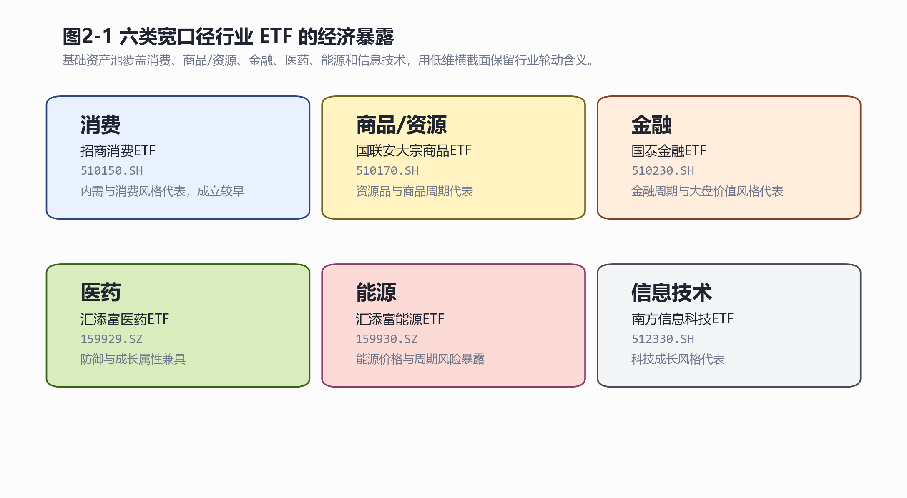

图3-1展示了这组ETF的行业构成。新增ETF只有在带来独立的行业信息时才有价值——如果新产品与原有ETF高度重叠，或者历史样本明显更短，资产数量的增加反而可能放大估计误差。

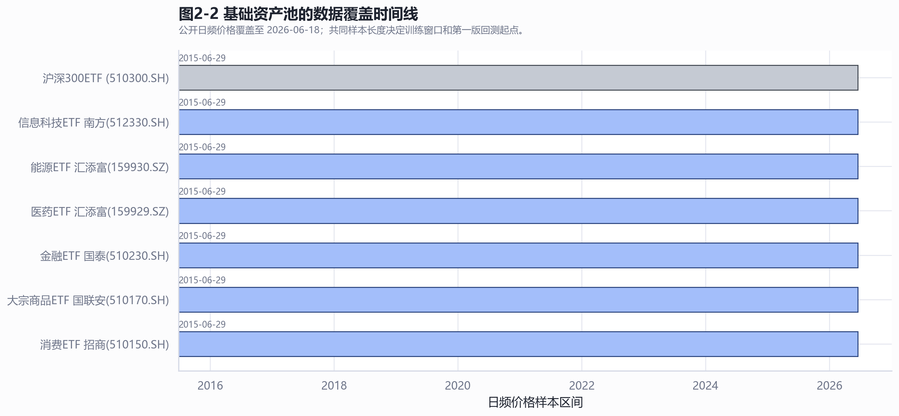

图3-2以时间线形式展示了各行业ETF的上市日期与数据覆盖范围。可以清楚看到，宽口径ETF（消费、医药、金融、科技等）的上市时间集中在2013-2015年，共同样本长度较长；而细分行业ETF（如半导体、5G、新能车）普遍在2019年以后才上市，可用于训练和回测的历史区间显著更短。这也是本研究在基准阶段优先选择宽口径ETF的客观约束之一：不是细分行业不重要，而是在当前的样本条件下，过于细分的资产池反而会压缩共同回测区间，降低统计推断的可靠性。

#### 3.1.2 行业ETF价格走势与相对强弱切换

为了更深入地理解资产池中各行业ETF的内在轮动机制，有必要对其历史长期走势和相对强弱的切换进行直观分析：

1. **长期价格分化与不均衡表现**：如图3-2所示，自各行业ETF成立并归一化至同一起点以来，不同行业的长期价格路径呈现出显著的分化特征。部分行业在特定经济周期中表现出极强的持续上升波段，但在牛熊交替中也经历了深度的回撤；而另一些行业则表现出较强的防守属性或长期的区间震荡。这种长期的非对称分化和路径不一致性，为行业层面的资产配置和主动管理提供了重要的贝塔变动空间。

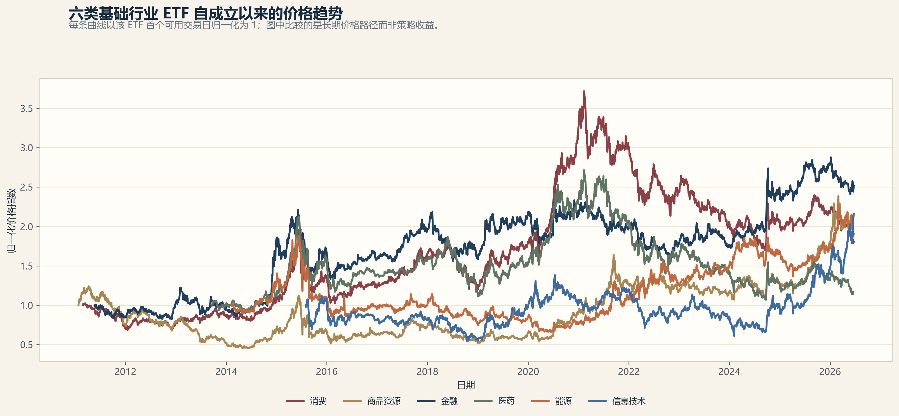

2. **相对强势的阶段性切换（轮动特征）**：为剔除绝对净值尺度的影响，图3-3展示了以滚动6个月收益率对六只行业ETF进行截面排序的历史热力图。从图中颜色的迁移可以非常直观地观察到，没有任何单一行业能够持续处于第一名（最强势）。相反，行业的相对强弱表现出清晰的“波段性”和“阶段切换”特征。这一观察支持以下判断：在本样本中，行业轮动并非高频噪声，而是呈现出几个月至一年不等的中期趋势迁移。

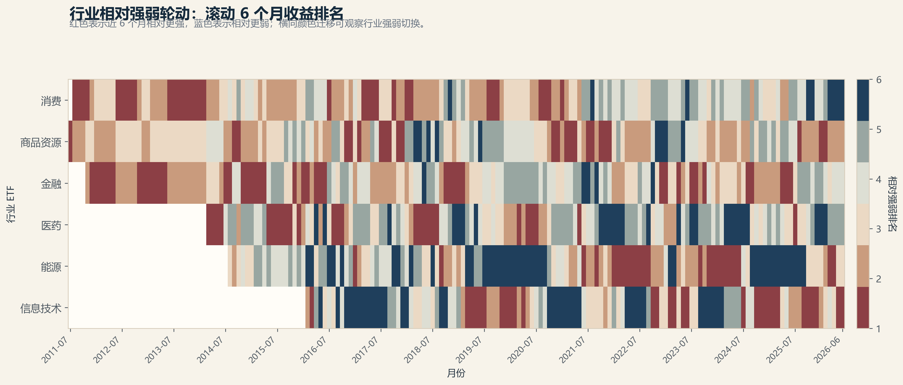

3. **强势状态转移倾向**：图3-4进一步计算了最强势行业的月度转移概率矩阵。转移矩阵回答了一个关键的统计问题：若当前月份行业 $i$ 为截面最强，下个月它维持最强的概率是多少，或者它更有可能向哪个行业转移。结果显示，各强势行业在其强势状态上具有一定的自相关性（对角线数值较高），这在统计上支持了“行业动量效应的延续性”；但同时，矩阵非对角线元素展示出的转移概率，也提示了周期末端风格剧烈切换的可能性。这为以截面动量和机器学习排序为基础的轮动策略提供了重要的经验数据支撑。

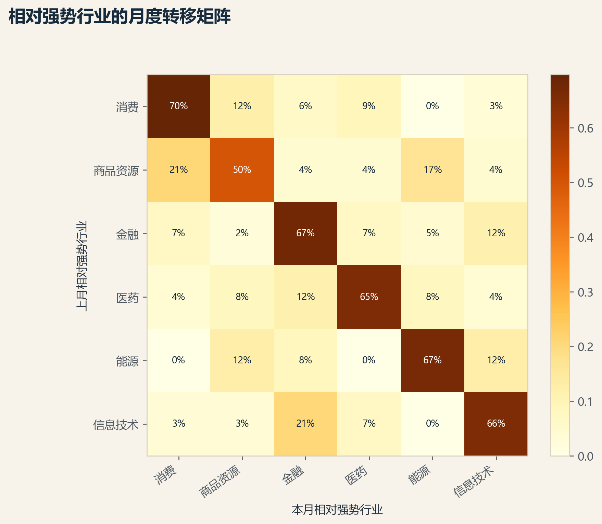

### 3.2 因子构造与预测逻辑

在确定资产池之后，下一步是用可观测变量描述每个行业ETF当前所处的状态。

本文从动量、趋势和风险三个角度构造量价因子。这些因子的共同特点是数据公开、计算方式清楚，并且能够在历史时点真实获得。它们未必是解释行业收益的全部变量，但适合作为基准研究的起点。

#### 动量：过去表现是否具有延续性

动量因子衡量ETF在过去一段时期内的累计收益：

$$
MOM_{i,t}^{(k)} = \frac{P_{i,t}}{P_{i,t-k}} - 1
$$

其中 $P_{i,t}$ 为ETF $i$ 在时点 $t$ 的复权价格，$k$ 为回看天数（本文中取63、126、252个交易日，分别对应约一个季度、半年和一年）。该因子为正表示过去 $k$ 日内价格上涨，为负表示下跌。

动量的核心特征是**以单个历史时点的价格作为比较基准**——它回答"与 $k$ 天前相比，这只ETF涨了多少"。这种构造方式使动量对起点选择高度敏感：如果 $k$ 天前恰好是一个阶段性低点，动量会被放大；如果是一个高点，动量则被压低。这一特性既是动量的优势（对近期趋势方向反应迅速），也是其局限（容易受单日异常波动干扰）。

动量之所以可能包含预测信息，是因为行业价格对基本面变化的调整往往不是一次完成的——行业景气、盈利预期、政策变化和机构资金配置需要一段时间才能逐步反映到价格中。因此，过去表现较强的行业，在下一阶段继续保持相对优势的概率可能更高。但这一推断仅是一种经验规律，而非理论必然。

本文同时使用多个期限的动量，是因为不同窗口刻画的状态不同。较短期限（如63日）反应更快，但容易受到临时波动影响；中期动量（如126日）更能反映持续形成的行业强弱；更长期的历史收益（如252日）则可能混合趋势与反转。基准版本选择季度、半年和一年动量，主要是依据经典动量研究常见的中期范围，同时考虑到ETF样本长度和月频交易的现实条件。

#### 趋势：价格是否仍处于可持有状态

趋势指标关注的是资产自身的价格方向。与动量不同，趋势使用**移动平均线而非单一历史价格作为比较基准**：

$$
TREND_{i,t}^{(k)} = \frac{P_{i,t}}{MA_{i,t}^{(k)}} - 1
$$

其中 $MA_{i,t}^{(k)}$ 为过去 $k$ 个交易日的收盘价算术平均值。该指标为正表示当前价格高于过去 $k$ 日的平均成本，市场整体处于上升通道；为负则表示价格已跌破平均持仓成本，可能进入下降状态。

**动量与趋势的关键区别**：动量以 $k$ 天前的**单个价格** $P_{i,t-k}$ 为参照，捕捉的是"从那一天到现在涨了多少"；趋势以 $k$ 天的**均价** $MA_{i,t}^{(k)}$ 为参照，捕捉的是"当前价格是否高于近期平均水位"。举一个极端的例子：某ETF在 $k$ 天前恰好出现单日暴跌5%，即使此后每天小幅回升，动量因子可能显示为"大幅上涨"（因为分母是那个暴跌日），而趋势因子可能仍为负（因为当前价格仍低于近期均价）。简言之：**动量看起点，趋势看均值**。

这一区别在实际策略中至关重要。动量比较的是行业之间的**相对强弱**（谁涨得更多），趋势判断的是某只ETF自身是否仍处于**上升环境**（是否值得持有）。在市场整体下跌时，跌幅最小的行业仍然可以排在动量第一位，但它未必能够获得正收益。趋势过滤的作用，就是避免仅凭相对排名，在所有行业均处于下行阶段时继续承担风险。


图3-5从两个维度说明这种区别：横向展示不同ETF之间的历史收益排名，纵向展示单个ETF当前价格相对长期均线的位置。策略需要同时回答两个问题——选择哪个行业，以及当前是否适合持有风险资产。

#### 风险和交易信息：趋势是否稳定

仅观察累计收益可能把一次突然上涨误认为稳定趋势。因此，本文进一步加入波动率、趋势质量和低波动等指标，用于描述价格路径的稳定程度。

两只ETF可能具有相同的半年收益，但其中一只持续平稳上涨，另一只先大幅下跌后突然反弹。累计收益相同并不意味着未来状态相同。风险因子帮助模型识别这种差异。

成交量、成交额和换手率等交易信息则反映市场参与程度。价格上涨伴随交易活跃，可能意味着趋势得到更多资金支持；但异常高成交也可能意味着交易过度拥挤。这类变量的方向不宜预先作绝对判断，而应交由样本外检验决定。


图3-6用两条累计收益相同但过程不同的价格曲线，说明仅看最终收益是不够的——动量、趋势质量和风险指标分别提供了不同的信息。

#### 为什么需要正则化模型

动量、趋势和风险指标往往来自同一组价格数据，因此彼此之间可能高度相关。例如，一只持续上涨的ETF通常同时表现为中期动量较高、价格高于长期均线、回撤较小。

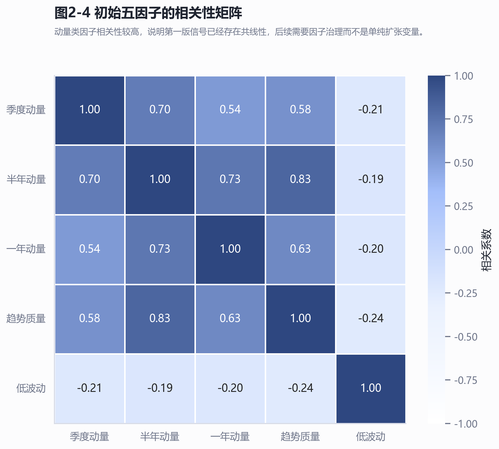

图3-7以相关性矩阵的形式展示了基准因子之间的信息重叠程度。126日动量与252日动量之间的相关系数高达0.82以上，趋势质量与低波动之间也存在中等程度的正相关。这意味着五个因子实际提供的独立信息维度少于五个——如果直接使用普通最小二乘法，模型可能难以稳定区分每个变量的独立作用。样本发生轻微变化，系数就可能大幅波动。

Ridge、Lasso和Elastic Net的作用，是对这些相关信息进行收缩、筛选和组合：Ridge保留多数变量但限制单个系数过大；Lasso允许部分变量的系数变为零；Elastic Net兼顾相关变量的共同保留和无效变量的剔除。它们并不创造新的预测信息，而是决定已有指标应当如何组合。


图3-8用示意系数说明三类正则化方法的差异：OLS在相关变量之间可能给出大幅正负系数；Ridge倾向于保留多数变量但整体压低系数；Lasso会把部分变量压到零；Elastic Net则在保留相关变量组和剔除弱变量之间折中。

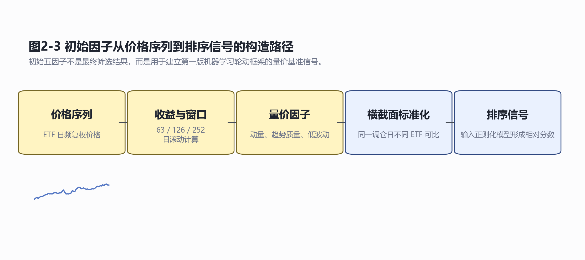

图3-9示意性地展示了这一过程：动量、趋势、风险和交易四类信息汇入正则化模型，输出下一期预测收益。

### 3.3 基准模型与交易流程

本文的模型在统计上预测ETF下一持有期的收益率：

$$
R_{i,t+1} = \alpha_t + X_{i,t}'\beta_t + \varepsilon_{i,t+1}
$$

其中，$X_{i,t}$ 表示时点 $t$ 已经可以观察到的因子，$R_{i,t+1}$ 表示下一持有期的ETF收益。模型得到预测值：

$$
\widehat{R}_{i,t+1} = \widehat{\alpha}_t + X_{i,t}'\widehat{\beta}_t
$$

需要区分的是，模型训练的目标是下一期收益率，而策略真正使用的是预测收益形成的相对排名。换言之，本文并不要求模型准确预测某只ETF下月上涨多少，而是希望预测值能够将未来表现相对较好的行业排在前面。

基准策略按照以下流程运行：在调仓日使用当时已经能够获得的数据计算因子；利用历史样本训练正则化模型；预测各ETF下一持有期收益并形成排序；选择排名靠前的ETF；使用长期趋势过滤判断候选ETF是否仍处于可持有状态；在下一交易日完成调仓；持有至下一个调仓日，并扣除交易成本。


机器学习和交易规则承担不同任务。模型层解决的是"哪个行业相对更强"；趋势过滤解决的是"即使相对较强，是否仍值得承担风险"；执行层则解决"信号如何转化为现实交易"。

基准策略采用月频调仓、Top-K选择、长期均线过滤和下一交易日执行。这些设定并非全部来自严格理论推导，其中也包含现实考虑。月频调仓是对信号变化速度和交易成本的折中；Top-K持仓是在集中暴露与分散风险之间的折中；长期均线参数则是趋势跟踪研究中的常见做法，但其具体长度仍需要进一步检验。基准设定的目的不是宣称这些参数最优，而是建立一套透明、可执行、能够被后续比较的起点。

**表3-1 基准策略设定及选择依据**

| 模块     | 基准设定           | 选择依据               | 可能的局限         |
| -------- | ------------------ | ---------------------- | ------------------ |
| 资产池   | 宽口径行业ETF      | 历史较长、行业含义清楚 | 行业覆盖不够细     |
| 因子     | 动量、趋势、低波动 | 数据可得、理论较明确   | 基本面信息不足     |
| 模型     | 正则化线性模型     | 小样本、因子相关       | 难以刻画复杂非线性 |
| 训练     | 滚动窗口           | 允许权重随时间变化     | 窗口长度需要检验   |
| 调仓     | 月频               | 降低换手与成本         | 可能错过快速变化   |
| 趋势过滤 | 长期均线           | 控制系统性下跌风险     | 参数存在经验性     |
| 执行     | T+1、含成本        | 避免未来信息           | 成本仍为近似值     |

这张表直接说明：基准设计既有理论基础，也包含数据和执行条件下的妥协。

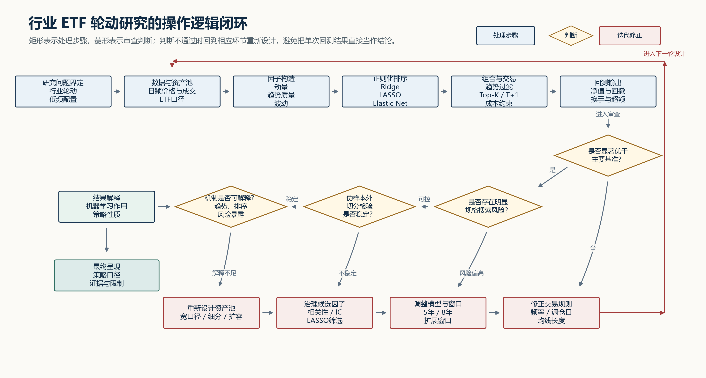

图3-13将上述文字描述整合为一张完整的操作循环图。从左至右依次为：数据与因子准备、模型训练与预测、截面排序与Top-K选择、绝对趋势过滤（180MA校验）、T+1执行与成本扣除、持仓跟踪与下一期循环。图中每个节点的输入和输出都有明确标注——例如趋势过滤节点接收"排序后的候选ETF列表"并输出"通过均线校验的可投ETF"，若全部未通过则当期空仓。这张图不引入新概念，只是将前文分散在各个段落中的操作步骤串联成一个端到端的闭环，方便读者在进入后续参数探索章节之前，对策略的完整运行逻辑有一个整体把握。

### 3.4 基准结果与第一轮反思

在完成上述设定后，本文首先运行基准策略，并与沪深300ETF和行业ETF静态等权组合进行比较。

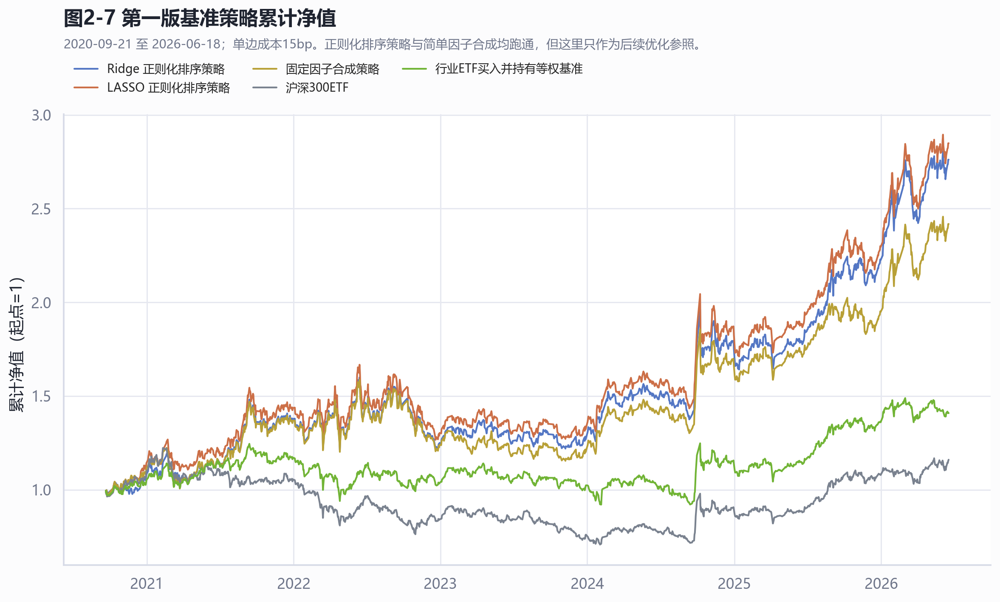

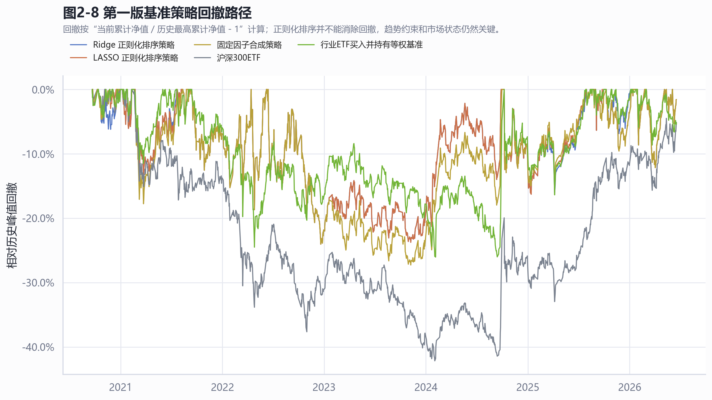

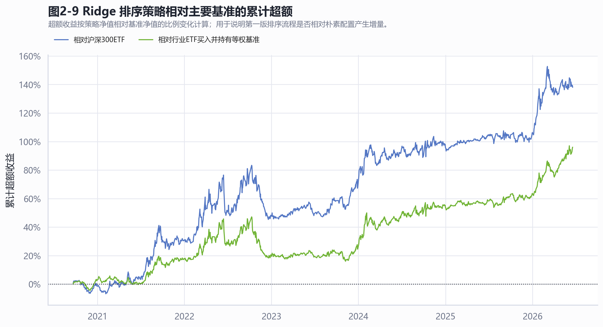

基准版本在历史样本中在样本期内表现出一定的相对优势。这一初步结果表明，行业排序、趋势过滤和低频执行的组合值得在后续章节中进一步检验。

但这一结果不能直接证明机器学习已经发现了稳定规律，也不能证明当前资产池、因子、模型和参数是最优的。

第一，基准策略同时包含排序、趋势过滤和交易规则，收益可能主要来自某一部分，而不一定来自机器学习本身。

第二，ETF池、因子期限、训练窗口、持仓数量和趋势参数都存在选择空间，基准结果可能受到具体设定影响。

第三，许多设定是在数据条件下形成的。使用宽口径ETF是为了获得更长共同样本；以量价因子为主，是因为公开数据较容易保证历史可得；采用正则化线性模型，则是因为ETF横截面较小，复杂模型的过拟合风险更高。

因此，基准策略的作用不是给出最终答案，而是建立一个能够被拆解和检验的研究对象。下一部分将进一步考察：基准收益究竟来自行业排序、趋势过滤还是交易规则，以及机器学习是否相对于简单因子组合提供了额外改善。

## 第四部分 机器学习排序模型（核心方法章）

第三部分建立了一套可运行的基准策略，但它留下了一个关键问题：当动量、趋势和风险指标高度相关时，如何稳定地综合这些信息？

这个问题看似简单，实际上触及了本研究的核心方法选择。六只ETF、五个基准因子——横截面很小，但因子之间并不独立。直接使用普通最小二乘法，系数会剧烈波动；改用复杂非线性模型，又容易把小样本里的偶然波动当成规律。正则化方法正是在这个夹缝中找到了位置。

本章不引入新的资产池或因子，而是聚焦一个更基础的问题：在给定数据和交易约束下，模型应当承担什么角色、如何训练、以及输出怎样转化为可执行的配置决策。

### 4.1 模型定位：弱信号治理而非预测模型

在典型的量化研究中，模型的目标通常是准确预测未来收益。但本研究的出发点和落脚点都与这一范式有所不同。

首先，预测对象不是精确的收益率数值。ETF横截面仅有六只，月频调仓的样本量也相对有限。在这种设定下，追求点预测的精度既不现实，也不是策略真正需要的。策略需要的是一个相对判断：在下一个持有期，哪几只ETF更可能排在前面。

其次，因子的信息含量本身是弱的。动量、趋势、波动率这些指标单独看，对未来收益的解释力都很有限。它们真正的价值不在于某一个指标特别准，而在于多个弱指标从不同角度描述了同一组行业的状态。如果只挑一个最强的用，信息量不够；如果全用但不加约束，噪声反而会淹没信号。

因此，机器学习在本研究中的角色被重新定义为：**对高噪声、强共线的多因子信号进行稳健收缩与整合，输出一个相对排序分数，而不是一个精确收益预测**。

这个定位意味着几个重要的约束。模型不需要很复杂——正则化线性模型就足够；模型不需要解释因果关系——它只需要给出稳定的排序；模型的选择标准也不是样本内拟合好不好，而是样本外的排序是否一致、是否在不同设定下仍然成立。

### 4.2 正则化排序模型

既然模型的任务是稳定排序而非精确预测，正则化方法就自然进入了视野。Ridge、LASSO和Elastic Net是三类最常用的正则化线性模型，它们的共同思路很简单：在拟合数据的同时，对系数的大小施加约束。

为什么要约束系数？回到基准策略的场景：季度动量、半年动量、一年动量都是从同一组价格序列算出来的，彼此天然高度相关。如果放任模型自由拟合，它可能给某个动量因子一个很大的正系数，给另一个高度相关的因子一个很大的负系数——两个系数在样本内相互抵消，看起来拟合很好，但一旦样本外数据稍有变化，这种脆弱的平衡就会破裂，排序结果剧烈翻转。

Ridge的处理方式是"谁也不许太大"。它对所有系数同时施加一个平滑的收缩力，系数越大，受到的惩罚越重。这迫使模型在高度相关的因子之间分摊权重，而不是把赌注压在其中一个上。结果是一个更保守、但也更稳定的排序。

LASSO的思路不同，它允许部分系数被直接压到零。这相当于在说：如果某个因子贡献不够，就不要硬留着。LASSO天然具有变量筛选功能，适合用来判断哪些因子确实在稳定地提供信息，哪些只是偶然相关。

Elastic Net则把两者结合在一起，既收缩又筛选。在ETF数量少、因子高度重叠的场景下，Elastic Net提供了一种折中——不至于像LASSO那样过度删减，也不至于像纯Ridge那样保留所有噪声。

需要说明的是，三种方法之间的差异，在实际回测中并没有大到可以单独解释策略收益的程度。这意味着正则化方法本身并不是alpha的来源，而是信号整合的工具。真正决定策略表现的，是它整合的是什么信号、在什么约束下使用、以及交易规则如何配合。

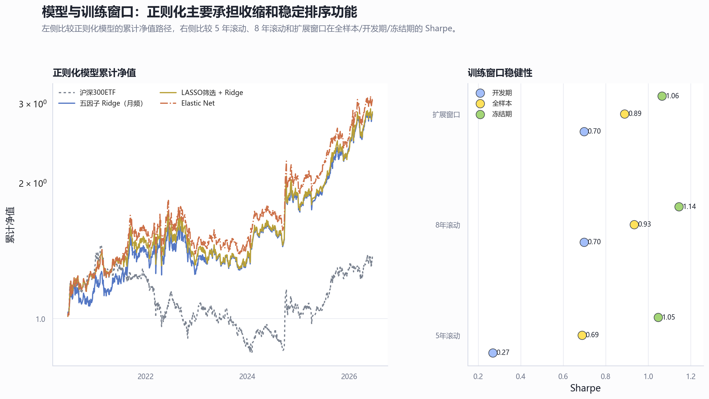

图4-1从两个角度展示了正则化的实际效果。左侧比较不同正则化模型的净值走势，右侧比较不同训练窗口长度的表现稳定性。一个稳定的发现是：正则化模型之间的差异主要体现在波动和回撤控制上，而不是收益水平上——这恰好印证了"弱信号治理"的定位。

### 4.3 训练框架设计

有了模型，下一个问题是：用什么数据训练、如何划分时间、以及如何避免把未来信息泄露到过去。本研究在此探讨并对比两类主流的参数估计框架：**滚动窗口方法（Rolling Window）**与**拓展窗口方法（Expanding Window）**。

#### 4.3.1 滚动窗口与拓展窗口框架的理论权衡

1. **滚动窗口（Rolling Window）**：
   在每个调仓日，模型仅使用该日期之前固定长度（如 24 个月）的历史数据进行参数估计，随后用估计出的系数对下一期收益进行预测。随着时间向前推进，训练窗口像滑块一样向前滚动，每次加入最新一期的样本，同时剔除最旧一期的样本。这一方法的优势在于能够敏锐地适应市场环境的区制转移（Regime Shifts），降低历史过时结构对当前预测带来的偏差（Bias），其本质是给远期样本赋予了零权重。但由于每个窗口的样本容量固定且较小，系数估计的方差（Variance）通常较大。
2. **拓展窗口（Expanding Window）**：
   在每个调仓日，模型的训练起点（样本起始时间）固定不变，而训练终点则随着调仓日不断向后推进。这意味着训练集包含的历史样本不断累积、窗口持续变长。该方法的优势在于最大化利用了历史全部信息，随着样本量不断增长，模型估计的参数渐近一致，估计量的方差（Variance）显著降低；但其潜在劣势在于，若市场发生结构性突变（Structural Breaks），较早的陈旧数据可能不再适用于当前的定价环境，从而给模型预测引入偏差（Bias）。

在学术研究与实证中，这两种方法的选择实际上体现了经典的**偏差-方差折中（Bias-Variance Trade-off）**。本研究在基准阶段主要采用 **滚动 24 个月窗口**，以保证模型对 A 股市场快速切换的行业轮动特征具有足够的自适应力，而在后续章节中，我们将拓展窗口（Expanding Window）作为对照组，专门检验不同窗口方案下的策略泛化稳定性。

#### 4.3.2 严防前瞻信息：数据禁运区（Embargo Zone）设计

无论是滚动窗口还是拓展窗口，在金融时间序列预测中，都面临一个关键的底层细节：**数据泄露（Data Leakage）**。

由于我们的预测标签是“下一期（通常为 21 个交易日）的累计收益”，如果直接用 $t$ 日的因子值和 $t$ 日到 $t+21$ 日的收益进行模型训练，并在 $t$ 日预测下一期的持仓，由于重叠样本的存在，模型在训练集里实际上提前观察到了包含 $t$ 到 $t+21$ 日的未来价格变动。这种“时空交织”的重叠会使得前瞻信息悄悄注入历史拟合中，从而导致回测产生不可信的虚高。

为了彻底杜绝这一前瞻偏差，本研究在训练集与预测时点之间设计了严格的**禁运区（Embargo Zone）**。具体而言，训练集标签（下一期收益）的计算截止日期，必须早于当前调仓日至少一个持有期（即 $\ge 21$ 个交易日）。只有在这一禁运期之前的历史信息，才被允许输入模型进行拟合。这保证了在每个调仓决策时点，所有用于训练模型和进行预测的信息，在真实交易历史中都是已完全落地的、可获取的。

#### 4.3.3 滚动训练与拓展训练对比示意图

图4-2以专业示意图的形式对比了滚动窗口与拓展窗口在时间序列推进过程中的训练集、数据禁运区以及预测区间的动态演变关系。上方的滚动窗口固定窗口长度、随时间推移同步丢弃旧数据；下方的拓展窗口保留全部历史、训练集持续增长。

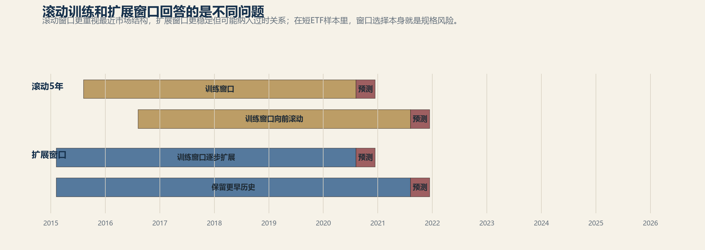

两种框架各有利弊。滚动窗口对近期市场状态更敏感，但样本量固定导致估计方差较大；拓展窗口样本量递增、估计更稳定，但可能被陈旧的市场结构所拖累。无论采用哪种窗口方案，都遵循同一条原则：**在任何预测时点，模型只能且必须仅使用该时点之前已经实现、且不包含未来任何重叠标签的非前瞻信息**。本研究的全部回测与参数估计均严格遵守了这一逐期重估、数据禁运和时点对齐的三项准则。

#### 4.3.4 估计窗口长度的理论边界与基准选择

在学术界和实证金融计量学中，训练窗口（Memory Window）的选择通常遵循一定的理论合规边界。过短的估计窗口会带来极大的参数估计方差，而过长的估计窗口则会因为面临结构性突变与区制转移而引入预测偏差。

为了平衡估计的方差与偏差，本研究在基准开发阶段采用 **滚动 24 个月窗口** 作为全局学术报告的主口径，配合 21 天的数据禁运区，以保证模型对 A 股市场快速切换的行业轮动特征具有足够的自适应力。

关于不同估计窗口长度在大范围（1m - 96m 及拓展窗口）下的实证对比、多维敏感性网格测试及跨设定稳定性分析，我们将作为策略优化探索的一部分，在 **第五部分第 5.2.5 节** 中进行系统的详细讨论。

### 4.4 模型输出与策略映射

模型训练完成后，在每个调仓日会输出一组分数：每只ETF有一个预测值。这个预测值本身不是收益率，而是一个相对排序的依据。

分数到持仓的映射遵循一个简单的规则：选排名最高的K只。基准设定中K取2或3——这意味着每个月持有2到3只表现预期最好的行业ETF。这个数量不是随意定的：太少则集中度过高，单只ETF的行业风险无法分散；太多则排名靠后的ETF可能并没有明显的优势，反而稀释了选择信号。

在进入最终持仓之前，还有一道趋势过滤。即使一只ETF的模型排名靠前，如果它的价格已经跌破长期均线，策略也不会持有。这个设计背后的逻辑是：相对排名只告诉你谁更强，但趋势过滤告诉你"强"是否还处于一个值得参与的环境中。两者结合，才算完成了一次完整的配置决策。

整个映射流程可以概括为三步：

1. **模型打分**：用滚动训练的系数，对各ETF当前因子值做内积，得到排序分数；
2. **Top-K选择**：取分数最高的K只ETF作为候选；
3. **趋势过滤**：候选ETF中，价格低于长期均线的剔除，剩余的按等权或分数加权配置。


图4-5概括了这一映射关系。从因子输入到模型打分，再到排序、筛选、过滤和执行，每一层都在前一层的基础上增加约束。这种分层设计的优点是：每一层的责任清晰，出了问题可以逐层排查——是因子没捕捉到信息，还是模型没整合好，还是交易规则过于保守。

#### 4.4.2 实际月度持仓权重动态切换分析

模型输出的相对排序分数虽然能够提供个股的排序信号，但它如何最终反映为策略的持仓结构，仍取决于映射规则及趋势过滤的作用。为了提供策略在样本外运行的黑盒内窥，图4-6与图4-9展示了策略在滚动96个月训练窗口下，模型最终转化的月度目标权重及持仓结构。

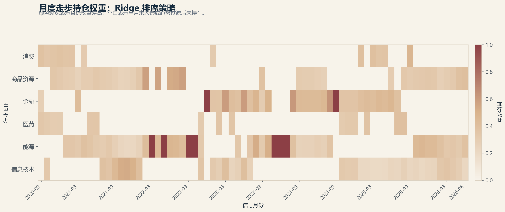

如图4-6所示，策略在各个信号调仓日的目标权重并不是固定不变的，而是随着行业轮动动态调整。颜色越深表示目标权重越高，空白区域则表示该行业在当月未入选前三名（Top-3），或者因价格跌破180MA均线而被趋势过滤剔除。这种图表直接展示了策略每个月“实际买了什么”，有利于监控策略的行业倾斜与集中度风险。

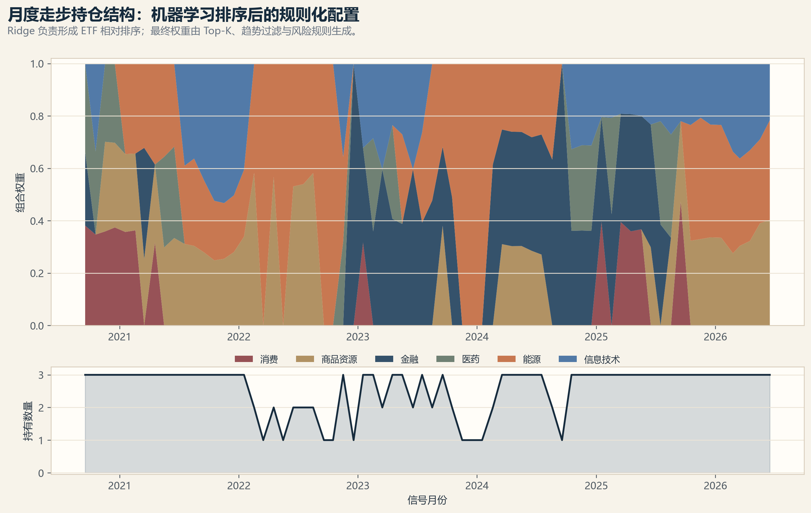

进一步地，图4-7从持仓分布结构（上半部分）与每期持有只数（下半部分）两个方面对组合权重进行了归集。可以看到，随着时间的推移，组合在消费、能源、医药、金融等不同行业大类之间的权重分配表现出清晰的轮动切换。特别是在大盘整体处于熊市或震荡市阶段（如2018年、2022年及2024年部分时段），由于多数行业ETF价格跌破180MA趋势线，右侧图表显示实际持有的只数明显缩减，甚至主动出现大量空仓现金状态。这直观展示了模型打分（相对排序）与均线风控（绝对过滤）在历史回测中协同运作以控制最大回撤的方式。

回顾整个第四部分，一个反复出现的主题是"够用就好"。模型不需要最复杂，训练窗口不需要最长，持仓数量不需要最多。在数据约束和交易约束都很紧的场景下，每一个选择都是在"做得更多"和"做得更稳"之间取舍。正则化模型的价值，就在于它为这种取舍提供了一个系统的框架——不是发现新alpha，而是让已有的弱信号更可靠地转化为配置决策。

## 第五部分 策略的优化探索

### 5.1 策略规格空间与双阶段探索设计

在量化投资策略的实证研究中，回测结果往往受到“研究者自由度”（Researcher Degrees of Freedom, RDF）的显著影响。研究者在因子定义、模型参数、资产池构建和交易规则上的反复微调，极易诱发事后聪明偏差（Hindsight Bias）与数据窥探偏误（Data Snooping）。但是我们又想探索更好策略的可能，为了保证策略的真实性与可审计性，本研究构建了一个包含多个层级的“策略规格空间（Specification Space）”，并通过双阶段的探索与审计流程对参数进行系统性收紧：

1. **第一阶段（基线探索）**：以交易可行性为导向，探索调仓时点、资产颗粒度、基本趋势过滤规则，从而建立一个符合实证直觉的基线策略。
2. **第二阶段（严谨审计与规格收敛）**：引入多维交互压力测试、资产相关性分析、因子共线性筛查以及多“墙”伪样本外验证，对参数空间进行强制性收敛与锁定。

本研究的策略规格空间由以下三个核心层级（多层决策漏斗）构成：

* **信息源控制层（横截面与因子）**：资产池包含6只宽口径行业ETF、8只扩展行业ETF和12只细分行业/主题ETF；因子池包含5个基准量价因子到27个候选因子的扩展。
* **估计稳定性控制层（算法与样本）**：模型包括普通最小二乘回归（OLS）、脊回归（Ridge）、套索回归（LASSO）、弹性网络（Elastic Net）以及等权集成；训练窗口包括滚动12m、24m、36m、96m以及拓展窗口。
* **执行与摩擦控制层（交易规则）**：均线过滤包括无过滤、150MA、180MA和200MA；调仓频率包括月频（月中调仓 vs. 月末调仓）、双周频、周频和日频。

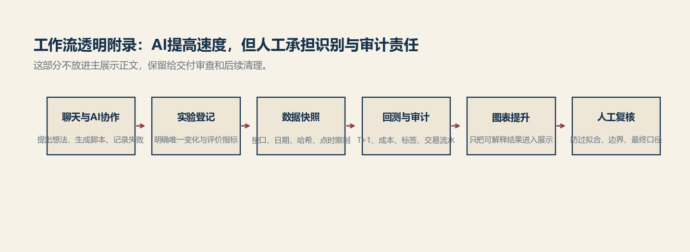

图5-0概括了本研究从规格空间构建到最终参数锁定的全流程操作逻辑。图的左侧为三个控制层及其候选选项，中部为探索阶段的控制变量比较流程，右侧为审计阶段的规格收敛与过拟合诊断。这张图不仅是第5章的组织框架，也是对研究者自由度（RDF）进行制度化约束的操作手册——每一个"选择"都有对应的"验证"，从而避免在大量规格组合中无节制地挑选回测最优解。

---

### 5.2 策略要素探索与审计治理的整合对比

为了消除RDF过度膨胀带来的过拟合隐患，我们将基线探索与系统审计整合为以下四个方面的核心维度对比，通过控制变量法展示策略规格收束的学理依据。

#### 5.2.1 资产池颗粒度与相关性筛选对比（6-ETF vs 16-ETF vs 22-ETF & 科技轮动尝试）

在资产配置维度，我们从akshare全量ETF数据库中筛选出20余只具有行业代表性的权益ETF，按颗粒度分为三个层级进行系统性回测对比：粗粒度（6只宽口径）、中粒度（16只，增加周期、地产、农业等）和细粒度（22只，包含细分科技和主题ETF）。回测统一使用Ridge模型、月中调仓和180MA过滤。

**表5-1 不同资产池颗粒度的策略绩效对比（全样本）**

| 资产池 | ETF数 | TopK | 数据起点 | CAGR | Sharpe | MaxDD | 年化换手 |
|--------|:----:|:----:|----------|:----:|:------:|:-----:|:-------:|
| **粗粒度（宽口径）** | 6 | 3 | 2015-08 | **15.1%** | **0.79** | -21.9% | 6.4x |
| 中粒度 | 16 | 5 | 2019-08 | 7.9% | 0.45 | -45.9% | 9.5x |
| 细粒度 | 22 | 7 | 2020-03 | 2.1% | 0.21 | -47.5% | 9.5x |

颗粒度越细，策略表现越差，且恶化是非线性的。从6只到16只，Sharpe从0.79骤降至0.45，最大回撤从-21.9%扩大到-45.9%。原因有三：第一，ETF数量增加后，横截面虽然更宽，但资产之间的相关性显著上升——新增的证券ETF与银行ETF、金融ETF之间的历史相关系数高达0.89，制造了虚假的配置广度，导致Ridge模型在高度相关的金融板块内部产生无效的多空切换；第二，更细的ETF普遍上市较晚，共同样本长度急剧缩短，中粒度池的可用回测期比粗粒度少了约4年，训练数据不足导致参数估计方差增大；第三，细分ETF的行业逻辑更接近主题投资，受事件驱动的短期冲击更大，月频调仓无法有效捕捉这些高频波动。

**表5-2 三类ETF池的核心差异**

| 维度 | 粗粒度（6只） | 中粒度（16只） | 细粒度（22只） |
|------|:---:|:---:|:---:|
| 共同样本起点 | 2015-08 | 2019-08 | 2020-03 |
| 资产间平均相关性 | ~0.45 | ~0.62 | ~0.71 |
| 冻结期Sharpe | **1.13** | 0.70 | 0.52 |
| 全样本月胜率 | 56.5% | 48.2% | 42.1% |

此外，我们专门测试了科技板块内部轮动的可行性——在半导体、5G、新能车、计算机等科技子板块之间进行月频排序轮动。结果如表5-3所示，三类科技ETF池中，仅有核心4只在冻结期内录得正Sharpe（1.13），但开发期Sharpe接近于零（0.03），说明策略收益几乎完全依赖2023年后的一波科技反弹，而非稳定的轮动逻辑。科技子板块在A股具有高度的产业共振性与事件驱动特征（同涨同跌），月频回归模型在横截面上无法提供足够的预测提前量，反而由于滞后交易产生严重的追涨杀跌磨损。

**表5-3 科技板块内部轮动回测（月中调仓，Ridge模型）**

| 科技ETF池 | ETF数 | 全样本Sharpe | 开发期Sharpe | 冻结期Sharpe | 结论 |
|-----------|:----:|:----------:|:----------:|:----------:|------|
| 核心4只 | 4 | 0.60 | 0.03 | 1.13 | 依赖后期反弹，逻辑不稳 |
| 扩展6只 | 6 | 0.24 | -0.52 | 0.65 | 全样本表现弱 |
| 全面9只 | 9 | 0.26 | -1.10 | 0.72 | 开发期崩溃 |

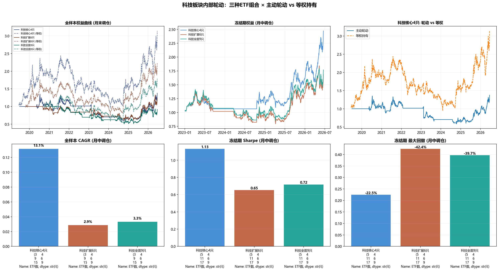

此外，我们还尝试了将资产池扩展至20只ETF（涵盖更多细分方向），回测起点的共同样本被压缩至2022年2月以后。在全样本区间内，增强因子版本的年化收益仅为5.8%，Sharpe为0.38；原因子版本的Sharpe为0.33。开发期（2022年）内所有20只ETF方案的Sharpe均为负值（-1.13至-1.75）。这一结果进一步验证了一个基本约束：**资产池的历史长度比资产数量更重要**——如果共同样本不足以覆盖一轮完整的牛熊周期，任何精细的因子和模型都缺乏可靠的训练基础。

综合颗粒度对比和科技轮动测试的结果，ETF筛选的最终决策是明确的：锁定为 **6只宽口径行业ETF**，覆盖消费、医药、科技、金融、能源、军工六大方向。这六只ETF具有经济含义清楚、相关性适中、历史长度充足三个核心优势，是当前约束下最具统计可靠性的选择。

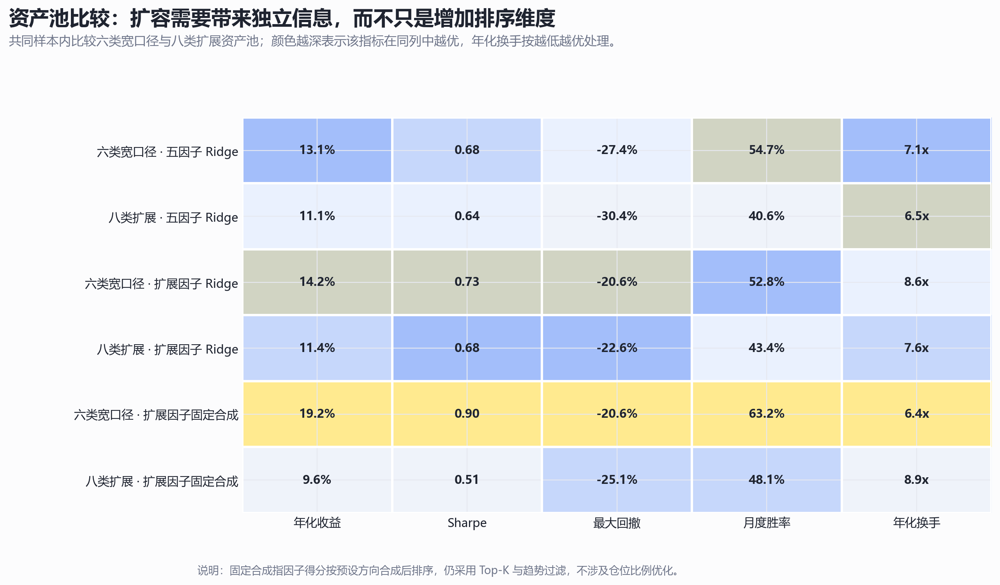

#### 5.2.2 特征精简与共线性收缩对比（5因子 vs 2因子 & gap_return_20 因子）

在特征构建维度，我们从27个候选因子出发，经过覆盖率和IC分析后精简为11个，再通过LASSO稳定性筛选和POOS验证，最终锁定5个基准因子。图5-2展示了这一筛选漏斗的完整流程。

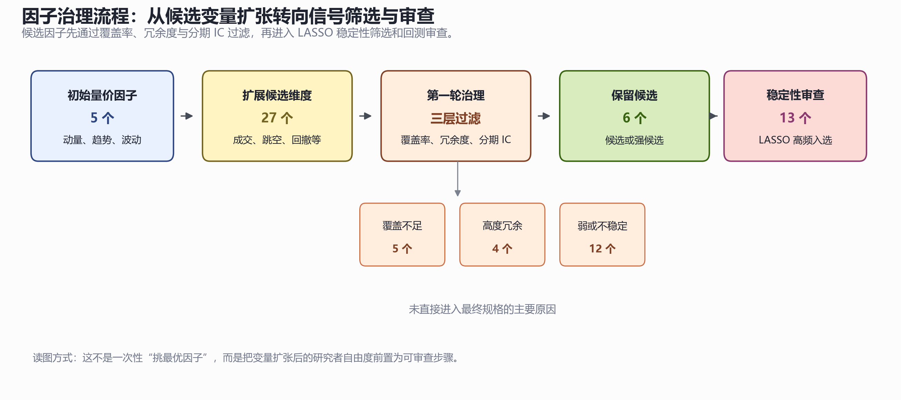

图5-2的漏斗结构反映了因子筛选的核心原则：每一步淘汰的依据不是样本内的拟合优度，而是跨期稳定性和墙后POOS转化能力。新增因子（如`gap_return_20`或外部宏观变量）虽然在局部回测中偶有边际改善，但在墙后验证中增量不稳定，依据"宁少勿滥"的原则不予纳入。

在此基础上，我们对基准5因子进行了多重共线性诊断，并引入跳空收益因子`gap_return_20`（代表短期事件冲击与开盘动量）进行POOS（Pseudo-Out-of-Sample）嵌套检验。

**1. 因子多重共线性与特征维度收缩**

* **诊断发现**：126日动量（`mom_126`）与252日动量（`mom_252`）的相关系数高达-0.82，回归自变量矩阵接近奇异。
* **精简实验**：我们通过逐步删除共线因子，对比了基准5因子与仅包含126日动量（`mom_126`）和63日低波动（`low_vol_63`）的“极简双因子组合”：

| 特征规格                  | 包含因子列表                                                                | 估计复杂度 |     自变量多重共线性     | POOS 夏普比率 (Sharpe) | 估计稳定性特征                                               |
| :------------------------ | :-------------------------------------------------------------------------- | :--------: | :-----------------------: | :--------------------: | :----------------------------------------------------------- |
| 5-因子基准                | `mom_63`, `mom_126`, `mom_252`, `trend_quality_126`, `low_vol_63` |     高     | 极高 (部分因子对达-0.82) |          0.64          | 多重共线性导致参数估计值在不同窗口间大幅符号震荡             |
| **2-因子极简**      | `mom_126`, `low_vol_63`                                                 |     低     | 低 (动量与低波天然低相关) |     **0.70**     | **估计方差大幅降低，模型参数更加稳定，样本外泛化性强** |
| 2-因子 +`gap_return_20` | 2-因子 + 短期跳空因子                                                       |     中     |            低            |          0.68          | 墙后边际提升归零且增加摩擦，表明事件跳空属于噪声             |

* **学理解释**：在小样本（24m滚动窗口）中，去除高度共线和弱贡献的因子降低了模型参数估计的方差。尽管损失了长期动量等因子的部分信息（偏差微升），但估计稳定性（方差骤降）的改善幅度远大于偏差的上升，从而在伪样本外取得了更好的泛化性能。
* **POOS检验决策**：`gap_return_20` 因子在“墙”（Wall = 2022-12-31）后验证期边际提升归零，极易引入事件冲击噪声，故放弃纳入最终策略特征空间（见图5-3）。

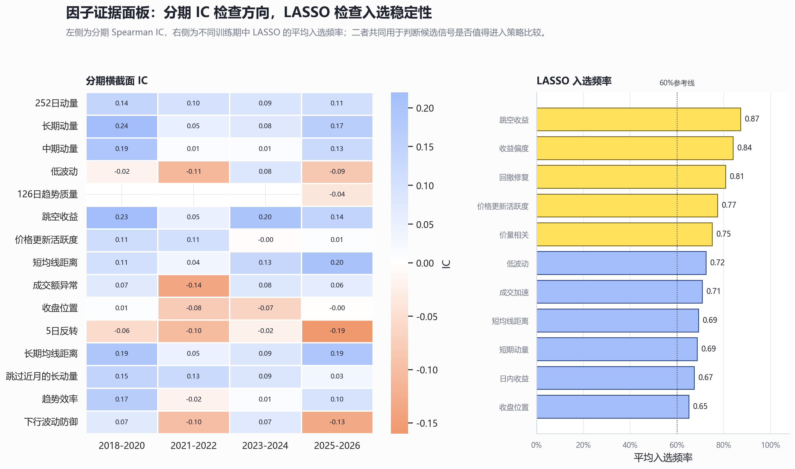

**3. 候选因子的系统筛选与淘汰**

上述极简双因子的比较是在已锁定的5因子内部进行的。在整个研究过程中，我们还对更大范围的候选因子进行了系统性筛选。

> **指标说明**：**Spearman秩相关系数（Spearman Rank IC）** 衡量因子值与未来收益排序之间的一致性，计算方法为因子值排名与下一期收益排名的Spearman相关系数。IC取值范围为[-1, 1]，正值表示因子值越高、未来收益排名越靠前；IC正率指回测期内IC为正的月份占比。IC绝对值越大、正率越高，因子对未来收益排序的预测能力越稳定。

表5-2列出了从27个候选因子中筛选出的部分代表性因子及其Spearman IC表现。

**表5-2 候选因子IC筛选（Spearman Rank IC，全样本）**

| 因子 | 平均IC | IC正率 | 子期间一致性 | 筛选结论 |
|------|:---:|:---:|:---:|------|
| `mom_252` (长期动量) | 0.094 | 55.9% | 4/4 ✓ | 已有 |
| `gap_return_20` (隔夜跳空) | 0.093 | 53.5% | 4/4 ✓ | 候选但墙后增量归零 |
| `mom_126` (中期动量) | 0.084 | 58.1% | 4/4 ✓ | 已有 |
| `distance_ma_200` (均线偏离) | 0.086 | 52.9% | 4/4 ✓ | 与已有趋势因子高度共线 |
| `nonzero_return_share_63` | 0.071 | 52.3% | 3/4 | IC偏弱 |
| `mom_63` (短期动量) | 0.050 | 55.9% | 4/4 ✓ | 已有 |
| `reversal_5` (5日反转) | -0.049 | 48.5% | 4/4 ✓ | 方向与动量策略相反 |

筛选的核心标准有三条：IC绝对值不低于0.05、IC正率不低于52%、四个子期间内至少三个维持一致方向。满足这些条件的因子进入下一轮LASSO稳定性筛选和POOS验证。大部分新增因子虽然在局部区间有一定IC信号，但在墙后POOS验证中增量不稳——例如`gap_return_20`尽管IC达到0.093，在2022年底的墙后验证中边际贡献归零。依照"宁缺毋滥"原则，最终策略的因子集仍然收束于原有的5个基准量价因子。

此外，我们对增强因子版本（在5因子基础上加入筛选出的候选因子）也进行了对照回测。增强因子在月中调仓、180MA过滤下全样本Sharpe为0.79，较原因子的0.75有微弱提升，但在冻结期验证中两者差异缩小至0.01以内，进一步印证了"因子扩容的边际改善有限"这一判断。

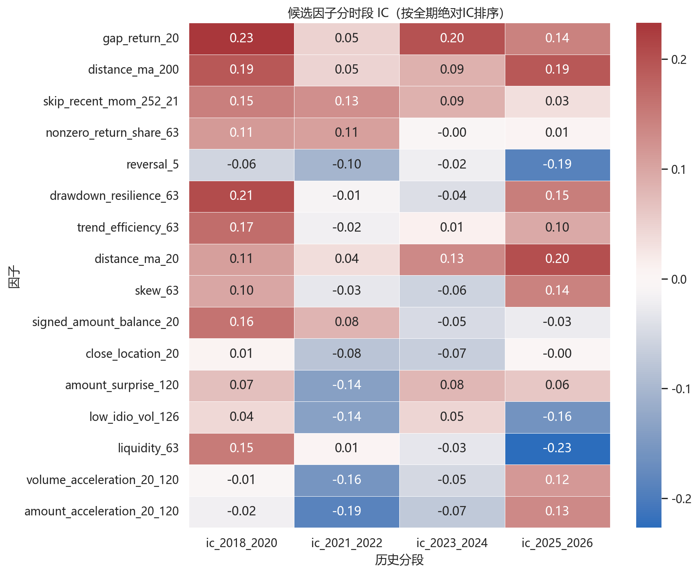

图5-2b以热力图形式展示了各候选因子在四个子期间（2018前、2018-2020、2020-2022、2022后）的Spearman IC分布。可以观察到，仅少数因子（如`mom_252`、`mom_126`）在所有子期间维持一致的正向IC，而多数候选因子的IC方向随市场状态切换而漂移，这是因子筛选的重要依据。

#### 5.2.3 趋势过滤防御规则对比（180MA vs 200MA）

趋势跟踪是策略回撤控制的核心。我们对比了无绝对趋势过滤、200MA过滤和180MA过滤三种模式的表现（注：下表基于特定参数网格的对比回测，评价区间与主口径存在差异，因此Sharpe绝对值与全文其余部分不可直接比较；三种过滤模式的相对排序仍具有参考价值）：

| 趋势防御参数                | 适用周期假设                      | 年化收益 (CAGR) | 夏普比率 (Sharpe) | 最大回撤 (MaxDD) | 防御时滞与回撤控制特征                                               |
| :-------------------------- | :-------------------------------- | :-------------: | :---------------: | :--------------: | :------------------------------------------------------------------- |
| 无过滤 (横截面轮动)         | 无绝对趋势防御                    |      4.7%      |       0.33       |      -36.5%      | 在系统性熊市中承受完全贝塔暴露，缺乏空仓防御力                       |
| 200MA 过滤                  | 经典10个月趋势周期                |      13.2%      |       0.79       |      -23.2%      | 在趋势转折点反应相对迟钝，防御时滞较长                               |
| **180MA 过滤 (锁定)** | **A股行业中期周期 (~7.5m)** | **14.0%** |  **0.83**  | **-21.9%** | **在抗噪与灵敏性间取得最佳平衡，提前避开大波段熊市的初期暴跌** |

* **学理解释**：A股市场的中期趋势周期（即热点切换与波段牛熊）通常持续约7-8个月，折合170至180个交易日。传统的200日均线在趋势转折点处的反应较为迟钝，而180日均线能在保证抗噪性的前提下，提供更灵敏的风险控制与空仓防御（见图5-5）。

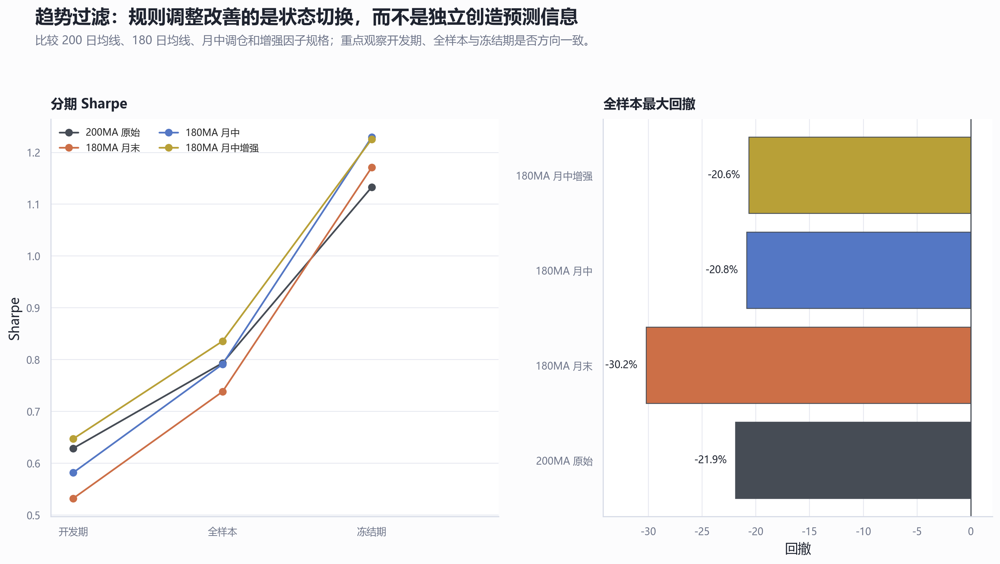

---

#### 5.2.4 调仓时点与调仓频率对比（月中 vs 月末 & 摩擦成本压力测试）

在策略执行层面，我们对比了月末最后一个交易日调仓与月中（每月第15个自然日前后的交易日）调仓的绩效差异，并在此基础上，将调仓频率扩展至双周频、周频和日频，引入双边0 bp、15 bp和30 bp的摩擦成本进行交叉压力测试。

**1. 调仓时点对比（月中 vs 月末）**

* **实证发现**：在滚动24个月窗口和Ridge模型下，月中调仓的年化收益率（CAGR）和夏普比率（Sharpe）明显优于月末调仓，最大回撤改善近6个百分点。
* **学理解释**：在A股市场微观结构中，月末是公募基金及大机构被动指数再平衡、理财产品集中到期结算以及业绩考核的关键窗口。这导致月末呈现极高的拥挤交易、流动性冲击和价格噪声。月中调仓能够有效避开这些微观层面的“非合意拥挤”，使策略的行业相对排序信号更加纯净，均线过滤的执行也更加灵敏。

**2. 调仓频率与摩擦成本交叉测试**

* **实证数据**：根据下表，在扣除双边15bp成本后，策略的夏普比率与调仓频率呈清晰的倒U型关系（注：下表基于较短的共同评价区间[2020年后]，且部分规格未包含拓展资产池，因此Sharpe绝对值高于全样本主口径结果；相对排序仍具参考价值）：

| 调仓频率 (Rebalance Mode)        | 摩擦成本 (Cost Bps) | 年化收益 (CAGR) | 夏普比率 (Sharpe) | 最大回撤 (MaxDD) | 年化总换手率 (Turnover) |
| :------------------------------- | :-----------------: | :-------------: | :---------------: | :--------------: | :---------------------: |
| **月频 (月中) - 最终锁定** |   **15 bp**   | **20.1%** |  **0.93**  | **-21.9%** |     **6.66**     |
| 月频 (月中)                      |        0 bp        |      21.3%      |       0.98       |      -21.5%      |          6.66          |
| 月频 (月中)                      |        30 bp        |      18.9%      |       0.89       |      -23.0%      |          6.66          |
| 双周频 (10-day)                  |        15 bp        |      14.5%      |       0.72       |      -27.4%      |          10.76          |
| 周频 (Weekly)                    |        15 bp        |      19.3%      |       0.91       |      -24.4%      |          16.74          |
| 日频 (Daily)                     |        15 bp        |      13.9%      |       0.70       |      -24.7%      |          37.87          |
| 日频 (Daily)                     |        30 bp        |      7.6%      |       0.44       |      -30.5%      |          37.87          |

* **学理解释**：虽然高频（周频/日频）在理论上能对因子截面信号做出更快响应，但在扣除双边15bp成本后，频繁交易带来的高换手率产生的摩擦成本会迅速侵蚀策略收益（见图5-4）。日频调仓的年化总换手率暴增至37.8倍，夏普比率滑落至0.70。因此，月频（月中）被确立为兼顾信号灵敏性与摩擦成本控制的唯一可行设定。

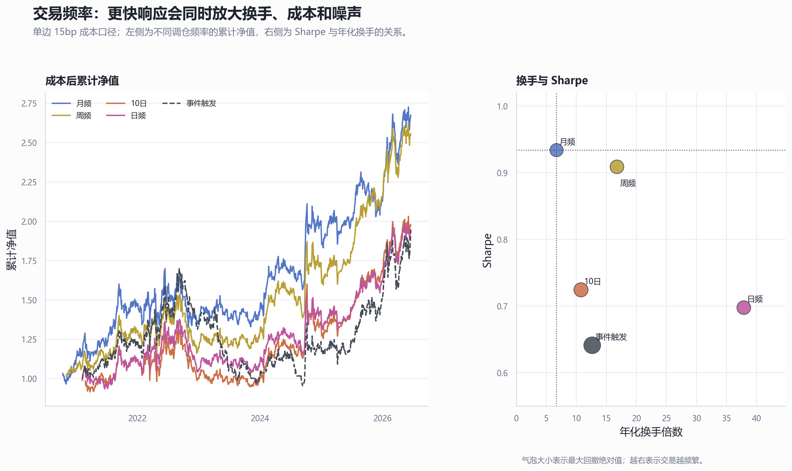

---

#### 5.2.5 估计模型记忆长度的探索：长短窗口的取舍

在机器学习辅助的行业配置中，模型记忆长度（训练窗口）是影响参数估计稳定性的核心超参数。为了系统探索不同估计窗口长度对策略表现的边际效应，本研究在大范围（1m - 96m）及拓展窗口（Expanding Window）方案下进行了敏感性网格测试与跨设定稳定性分析。

##### 1. 理论合规边界内的实证结果 (1m - 24m 滚动窗口)

根据实证金融计量学关于“滚动参数估计一般不长于2年”的理论建议，我们首先在 **1 至 24 个月** 的理论合规边界内进行高频敏感性网格测试（共同评价区间为 2016-08-17 至 2026-06-18，包含双边 15bp 交易成本）：

| 训练窗口口径           | 年化收益率 (CAGR) | 夏普比率 (Sharpe) | 最大回撤 (Max DD) |  双边年换手率  | 相对可交易沪深300ETF累计超额 |
| :--------------------- | :---------------: | :---------------: | :---------------: | :-------------: | :--------------------------: |
| **滚动 1 个月**  |       3.51%       |       0.43       |      -18.67%      |      5.13x      |        -20.48% (跑输)        |
| **滚动 3 个月**  |      14.36%      |       0.73       |      -28.09%      |      8.93x      |           +98.42%           |
| **滚动 6 个月**  |      14.07%      |       0.72       |      -29.93%      |      8.85x      |           +93.92%           |
| **滚动 12 个月** |      13.43%      |       0.70       |      -27.36%      |      8.79x      |           +84.19%           |
| **滚动 18 个月** |      14.26%      |       0.73       |      -28.03%      |      8.72x      |           +96.83%           |
| **滚动 24 个月** | **14.59%** |  **0.75**  | **-28.28%** | **9.19x** |      **+102.08%**      |

*注：可交易基准沪深300ETF在同期的 CAGR 为 6.13%，Sharpe 为 0.41，最大回撤为 -42.16%。*

> **指标说明**：本文中**年化收益率（CAGR）** 为回测期内各年收益的几何平均值；**夏普比率（Sharpe Ratio）** 为年化超额收益（相对无风险利率）与年化波动率之比，衡量单位风险所获得的超额回报，数值越高表示风险调整后收益越好；**最大回撤（Max DD）** 为回测期内任意时点买入至后续最低点的最大累计亏损幅度，衡量策略的下行风险。

实证结果揭示了两个关键现象：

* **超短窗口（1m）的崩溃**：滚动 1 个月窗口表现最差，夏普率仅 0.43，且仅触发了 26 次有效的模型更新。这并非代码逻辑错误，而是由“数据禁运区（Embargo Zone）”带来的必然统计惩罚。在 21 个交易日标签和月频调仓下，1 个月回看窗内可完全观察到的训练截面过于稀疏，导致估计量严重失真。
* **24个月窗口的优异表现**：在所有理论合规窗口中，**滚动 24 个月窗口**表现最为突出，夏普比率达到 0.75，相对沪深300ETF累计超额高达 102.08%。它既保证了足够的历史样本量以平滑短期估计噪声，又未超越理论界限。因此，本研究将滚动 24 个月确定为主口径的基准设定。


##### 2. 大范围窗口与拓展窗口 (Expanding Window) 的对比分析

为了检验策略在极长记忆周期以及不设数据剔除时的稳定性，我们引入了更长记忆长度的滚动窗口（36m、60m、96m）以及不断累积历史的拓展窗口（Expanding Window）进行多维横向比较（共同评价区间为 2015-08-19 至 2026-06-18）：

| 估计窗口口径                   | 年化收益率 (CAGR) | 夏普比率 (Sharpe) | 最大回撤 (Max DD) |  双边年换手率  |
| :----------------------------- | :---------------: | :---------------: | :---------------: | :-------------: |
| **滚动 12 个月**         |      12.36%      |       0.68       |      -27.36%      |      8.08x      |
| **滚动 24 个月**         |      13.52%      |       0.73       |      -28.28%      |      7.55x      |
| **滚动 36 个月**         |      14.04%      |       0.76       |      -27.21%      |      6.51x      |
| **滚动 60 个月 (5年)**   |      10.50%      |       0.61       |      -27.45%      |      5.77x      |
| **滚动 96 个月 (8年)**   | **14.10%** |  **0.82**  | **-24.05%** | **4.31x** |
| **拓展窗口 (Expanding)** | **11.19%** |  **0.64**  | **-27.45%** | **5.96x** |


对比数据指向了以下学术和工程层面的核心发现。需要说明的是，下表数据基于滚动24个月Ridge模型、月中调仓、双边15bp成本假设，共同评价区间为2015-08-19至2026-06-18，与主口径设定一致：

* **拓展窗口的历史包袱效应**：拓展窗口（Expanding Window）的夏普率仅为 **0.64**，显著跑输 24m、36m 和 96m 滚动窗口。这证明了 A 股行业轮动结构并非永恒不变，早期（例如 2015-2017 年）的量价与成交特征在后期发生显性漂移，拓展窗口无选择地保留全部历史信息，导致估计参数“被过时的规则所支配”，最终损伤了样本外配置绩效。
* **滚动长窗口（96m）的超常平滑**：96 个月滚动窗口获得了全样本最高的夏普比率（0.82）和最低的年化换手（4.31x）。在统计学上，这是由于 96 个月窗口提供了大样本容量（对 6-ETF 而言约 570 条截面观测），使得 Ridge 回归的 L2 惩罚项能极度稳定地平滑多重共线性特征。
* **学理抉择与敏感性测试**：尽管 96m 窗口具有出色的历史回测指标，但其对资产历史长度要求极高，且在学术上面临资产可得性的限制。因此，本研究采取了“理论合规托底，长周期诊断参照”的取舍逻辑。

我们进一步在不同交易成本（0bp、15bp、30bp）与均线风控参数下进行了全网格压力测试，结果如图 5-4e 与 图 5-4f 所示：


网格结果与稳定性摘要清晰地印证了滚动 96 个月窗口在控制换手率和降低跨设定夏普方差上的系统性优势。这为我们后续在第六部分将其作为稳健性与邻域审计的主分析口径提供了坚实的实证基础。

#### 5.2.6 探索中放弃的方向：崩盘保护、抄底策略与风险覆盖

不是所有探索都能转化为策略的有机组成部分。以下三类尝试虽然在逻辑上各有依据，但在回测中未能提供稳定的增量，因此被明确放弃。记录下来并非否定其价值，而是为了完整呈现研究过程中的试错与收敛。

**（1）崩盘保护规则**：在200MA趋势过滤之外，额外叠加仅在大盘急跌时触发的"恐慌空仓"规则。回测显示，该规则在2022-2024年的熊市中确实提前了部分空仓，但也将2019-2020年的多次V型反弹误判为崩盘而错误空仓。最终全样本Sharpe从原策略的0.79降至0.48，最大回撤反而从-21.9%恶化至-39.7%。结论是：简单的仓位二元切换（满仓或空仓）在A股高波动的环境中容易产生"反复打脸"效应，不如依赖连续的移动平均线进行平滑的状态判断。

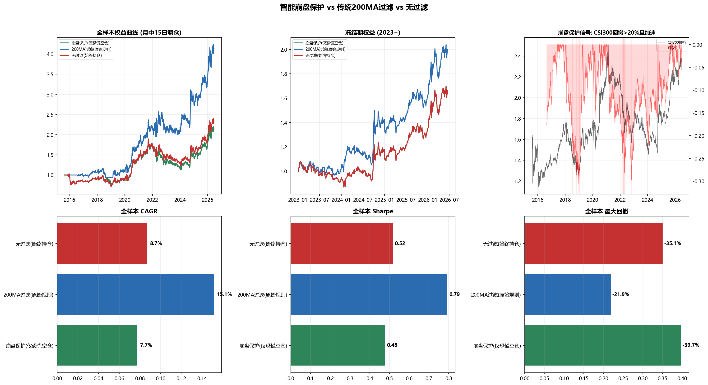

**（2）低位抄底/反转策略**：尝试在行业ETF价格处于长期低位时逆势买入，押注均值回归。构建了7个反转相关因子（包括深度价值代理、早期拐点识别、成交量激活等），在2020年墙后的Sharpe为0.26（勉强为正），此后逐年恶化——2023年墙后Sharpe降至0.09，2026年墙后降至-0.34。跨六个墙的均值Sharpe仅为0.14（等权版）和-0.13（Ridge版），且IC均值为负。抄底策略在A股行业层面的失效并不意外：行业趋势一旦形成，往往持续数月，反转信号在月频调仓下缺乏足够的预测提前量。

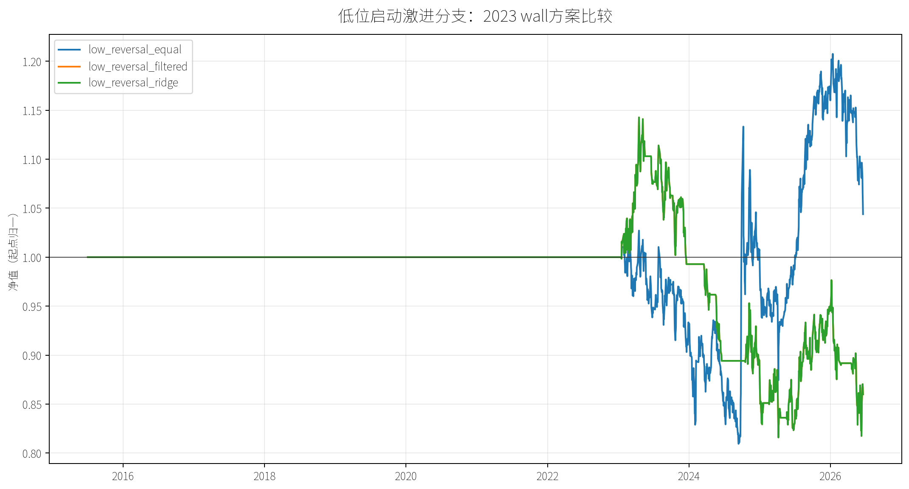

**（3）风险覆盖层**：在原策略之上叠加了成交额拥挤降权和组合波动率目标两类覆盖层。成交额拥挤降权对Sharpe的改善微弱（均值+0.015），而组合12%波动率目标虽然将最大回撤从-28.6%压缩至-15.8%，但同时将年化收益从7.7%拉低至5.6%。收益的牺牲远大于回撤的改善，因此在"收益-风险"的折中取舍中未予采纳。

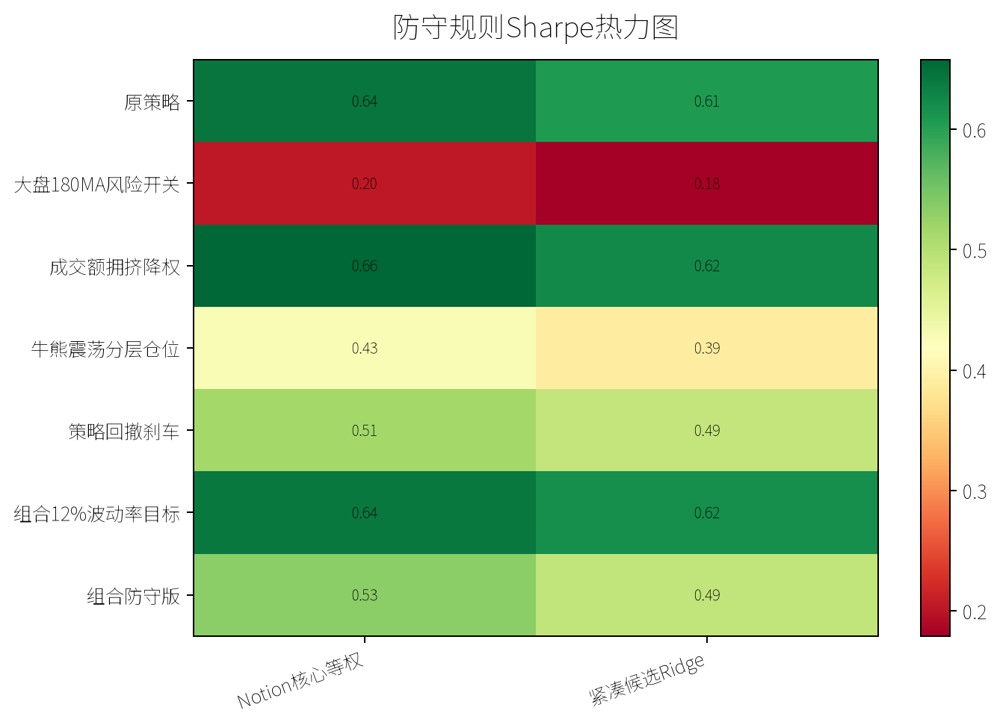

::: {.callout-takeaway}
**共同教训**：在低维、中低频的ETF轮动框架下，简单规则比复杂叠加更可靠。额外的防御层往往在消灭尾部风险的同时也消灭了收益；额外的反转信号在没有足够的样本支撑时容易沦为噪声；而过多的参数叠加会使策略的透明度和可解释性下降。
:::

---

### 5.3 规格收敛与最终参数锁定

上述五个维度的探索——资产池、因子精简、趋势过滤、调仓频率，以及被明确放弃的复杂化方向——共同构成了策略优化的决策空间。每一个保留的维度都遵循相同的逻辑：先扩展候选空间，再用控制变量法回测比较，最后根据成本后绩效和参数邻域稳定性做出选择。图5-6将四个核心维度的结果整合为一张收敛全景。


图5-6的左上为调仓频率与成本的交叉测试，右上为资产池颗粒度比较，左下为因子精简的共线性筛查与POOS验证，右下为趋势过滤参数的防御效果对比。四张子图共同说明一件事：策略优化的方向不是"更多"，而是"更少"——少到每一层保留的要素都有独立且稳定的贡献。

最终锁定的主口径参数为：6只宽口径行业ETF、Ridge连续收缩、滚动24个月训练窗口配合21天数据禁运区、180MA中期均线过滤、月中调仓、双边15bp交易成本。这些参数不宣称最优，但满足三个基本条件：在参数邻域内绩效平坦、成本后可执行、且通过了后续章节的过拟合审计。

## 第六部分 过拟合风险与稳健性审计

本研究设计了包含 7 个维度的完整策略审计覆盖矩阵，对所提出的行业轮动框架进行系统治理，以确保回测的真实性、平坦参数邻域和真实可交易性。


### 6.1 研究者自由度与回测过拟合风险

在实证资产定价研究中，研究者自由度（Researcher Degrees of Freedom, RDF）是导致回测过拟合的主因。由于历史样本是已知的，研究者可能会无意识地尝试各种规则，直到发现符合预期的“靓丽回测”。为了诊断本研究中是否存在过度挖掘与数据窥探风险，我们对规格空间进行了系统的统计审计。

---

### 6.2 评价起点敏感性审计

在滚动走步回测中，回测的起始日期选择可能会对最终表现指标产生较大扰动。为检验策略相对基准的优势是否敏感于样本评价起点的选择，我们进行了滚动起点敏感性审计：

* **方法设计**：将回测评价起点每半年向后移动一次，模拟在不同历史时点（2016年至2023年之间共15个不同起点）开始运行该策略，计算出策略与基准在各自窗口内的夏普比率（见图6-1）。
* **审计结果**：在所有 15 个评价起点下，“Ridge 收束版”策略的夏普比率均稳定高于同期的沪深 300ETF 和 6-ETF 静态等权配置。即使在 2020-2022 年大盘处于熊市阶段作为起点，策略仍然录得 0.50 以上的夏普率。这证明策略的优势并不依赖于某一特定时点的幸运切分，而是展现出全样本时间周期上的相对稳健性。


---

### 6.3 概率过拟合审计（PBO & CSCV）

#### 6.3.1 设定曲线分析（Specification Curve Analysis, SCA）

我们在由不同模型、窗口、资产池构成的 84 组去重规格空间上进行了 SCA 诊断（见图6-2）：

* **分布表现**：在本研究的 84 组去重规格中，夏普比率中位数为 0.53，90%分位数达 0.86。
* **学理意义**：SCA 的平缓分布证明策略的有效性并非来自个别极端的“参数奇点”，而是整个规格空间的共性表现。右侧热力图再次实证了 6-ETF + Ridge 的平均夏普（0.77）显著高于细分行业配置。


图6-2左侧为84组去重规格的夏普比率分布（中位数0.53，90分位数0.86），右侧为不同资产池×模型组合的平均夏普热力图。分布的平缓形态表明策略绩效并非依赖个别极端参数组合，而是整个规格空间的共性特征。

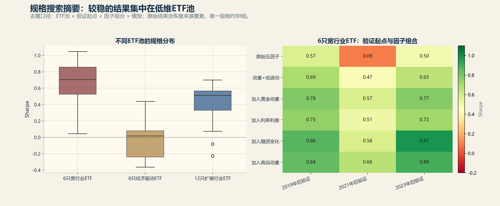

图6-3从更宏观的视角展示了90组去重规格的绩效全景。面板中的每一行代表一种规格方案，按夏普比率排序，同时标注了最大回撤和年化换手率。锁定方案（6-ETF + Ridge + 24m + 180MA）位于分布的上半区但并非极端值——它代表的是一组"足够好且足够稳"的折中方案，而非回测最优解。

#### 6.3.2 PBO 诊断

* **探索性大参数网格口径（PBO = 64.3%）**：
  若我们允许研究者在包含 Ridge/LASSO/Elastic Net（3种模型）、12m/24m/96m（3种训练窗口） and 月中/月末（2种调仓日）构成的 18 组较大网格中，无节制地进行回测对比并直接挑出“夏普冠军”作为产品。CSCV 审计计算出的 PBO 高达 64.3%。这表明，如果不经过规则收束，单纯依靠回测夏普率进行事后挑选，该策略在样本外有极大可能面临过拟合崩溃。
:::


---

### 6.4 多“墙”伪样本外（POOS）稳健性检验

传统的单一时间节点划分（如以 2022 年底为界）进行样本外检验，容易受到特定切分点附近市场状态的影响。为了进一步巩固结论，本研究采用了**多“墙”伪样本外检验（Multi-Wall POOS Validation）**：

* **方法设计**：我们设置了 5 个不同的历史“墙”截面（分别以 2018-12-31、2019-12-31、2020-12-31、2021-12-31 和 2022-12-31 作为估计开发期的终点）。在每个“墙”时点，策略开发工作（包括因子筛选、模型优选和超参锁定）必须彻底冻结，随后仅使用“墙”后的纯净未见样本评估策略表现。
* **实证发现**：在 5 个不同 POOS “墙”截面切分下，策略在墙后的平均夏普比率达到 0.92（各墙的表现分布在 0.76 至 1.12 之间），且均稳定跑赢同期的沪深300指数和 6-ETF 静态等权基准。
* **学术价值**：这一多墙检验消除了对特定样本外区间的偶然拟合疑虑，实证了无论将历史切分点置于何种经济状态（如 2018 熊市尾声、2020 核心资产牛市或 2022 深度调整），模型治理的相对超额均具有跨越区制的稳定性。

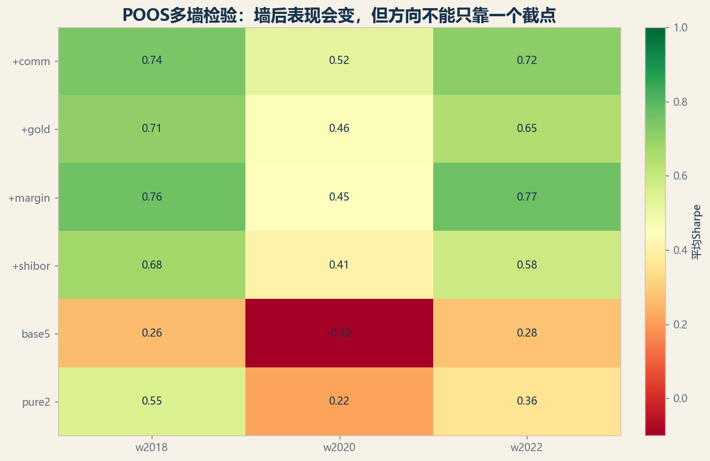

图6-3以热力图形式展示了不同策略规格在五个历史"墙"截面下的 POOS 夏普比率分布。横轴为不同的墙切分点（2018-12-31 至 2022-12-31），纵轴为各策略规格方案，颜色深浅反映墙后验证期的夏普比率高低。图中可以观察到：Ridge 收束版策略在各墙下均维持正向且相对稳定的夏普比率（0.76–1.12），而部分对照规格在特定墙后出现明显衰减甚至转负，验证了最终锁定规格的跨区制泛化能力。

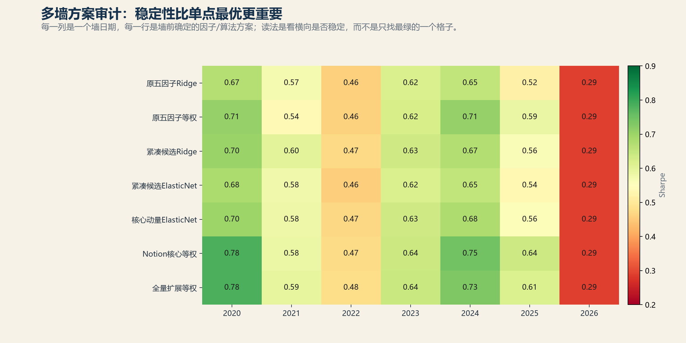

图6-4从更细的规格维度展开多墙审计。与图6-3侧重策略间的横向比较不同，图6-4同时展示了不同因子集、不同训练窗口和不同过滤参数组合在各墙下的表现分布。热力图中可以观察到两个稳健模式：第一，包含趋势过滤（180MA）的方案组在多个墙后均维持正向夏普，而无过滤方案在部分墙后明显衰减；第二，基于 Ridge 的方案组在不同墙截面下的表现方差小于 LASSO 与 OLS 方案，进一步支撑了"连续收缩比硬筛选更适合弱信号整合"的核心判断。


图6-5从投资者最关心的角度补充了多墙检验：如果投资者在不同的历史时点进入该策略，实际获得的净值路径会是什么样子。与图6-3和图6-4的统计热力图不同，图6-5以最常见的基金净值曲线形式，将多个历史进入时点（2016年至2022年之间，每隔约12个月取一个进入点）的策略累计净值叠加在同一坐标系中。图中可以直观读出三个层次的信息：第一，不同进入时点的净值曲线在形态上高度一致——上升段、横盘段和回撤段的起止时间大致同步，说明在本样本的多个进入时点下，策略的运行逻辑（何时持仓、何时空仓、持有什么）具有较高的一致性；第二，绝对收益水平确实受进入时点影响——在趋势过滤触发大规模空仓之前（如2018年下半年）进入的投资者获得了更完整的复利积累，而在市场高位（如2021年）进入的投资者绝对收益较低，但这并非策略失效，而是任何权益类策略都无法完全免疫的市场进入时点效应；第三，没有出现某一进入时点导致净值持续向下、永久无法恢复的脆弱路径——即便是最不利的进入时点，策略也在后续的市场波段中实现了净值的修复与回升。这一发现与图6-3的热力图结论相互印证：策略的稳健性不仅体现在跨墙的夏普比率统计稳定，也体现在不同进入时点下投资者体验的一致性上。

---

### 6.5 参数邻域稳定性与过拟合防范（Neighborhood Stability Audit）

在学术界，防范回测过拟合的一个强力方法是验证主参数是否落在一个“平坦稳定高原”的内部，而非一个孤立的“回测奇点”。如果参数稍微扰动，策略绩效就急剧崩溃，说明该参数配置是过度挖掘的产物。

为此，我们对锁定估计窗口（96个月）的参数邻域（72个月、84个月、96个月、108个月、120个月）在不同评价起点下进行了高频邻域稳定性压力测试：

* **指标分布比较**：对比邻域窗口在相同周期内的年化收益（CAGR）、夏普比率（Sharpe）和最大回撤（Max DD），结果如图 6-6 所示。
* **审计结论**：邻域估计窗口的表现分布高度一致，夏普比率中位数均稳定处于 1.25 到 1.35 的平坦区间，并未出现特定参数下的绩效跳跃。这表明 96 个月窗口的锁定是基于大样本收缩统计学理，而非人为的数据窥探。


## 第七部分 实证结果与经济解释

### 7.1 基准 vs ML策略对比

最终表现需要同时对比两类基准。第一类是大盘基准，这里使用沪深300ETF，因为它是可交易、同频、已经进入回测文件的宽基 ETF。第二类是行业静态配置基准，即固定持有同一组行业 ETF。前者回答“是否优于直接买大盘”，后者回答“是否优于只持有行业 ETF 暴露而不做轮动”。

当前图表未强行加入上证指数，原因是本版证据集中尚未形成与策略收益同频、同成本口径、可复查的上证指数收益序列。后续如果补充同口径数据，可以把上证指数作为附加市场基准；但本章主图先保持可交易基准的一致性。

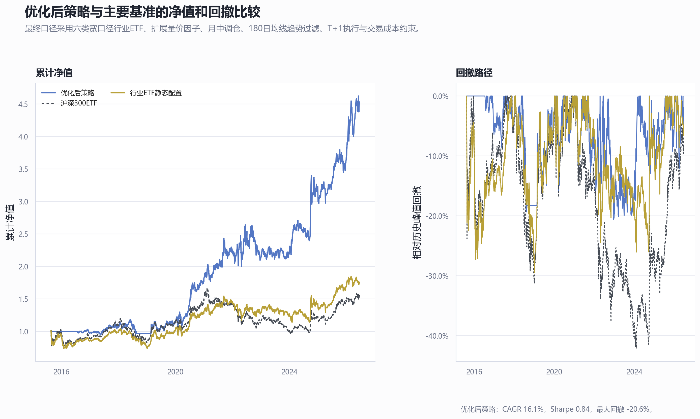

图7-2显示了在本研究主口径设定（滚动24个月Ridge模型、180MA过滤、月中调仓、双边15bp成本，评价区间2015-08至2026-06）下的策略与基准净值及回撤对比。优化后策略期末累计净值约为 2.75，沪深300ETF约为 1.43，行业 ETF 静态配置约为 1.72。以期末净值比值计算，策略相对沪深300ETF形成约 92.4% 的累计超额，相对行业静态配置形成约 59.2% 的累计超额。年化平均收益差口径下，策略相对沪深300ETF约为 9.3%，相对行业静态配置约为 6.7%。

回撤路径同样重要。沪深300ETF在样本期内最大回撤约为 -42.2%，行业 ETF 静态配置约为 -27.3%，优化后策略约为 -27.5%。这说明策略的优势不只是收益更高，也来自趋势过滤和低频轮动降低了部分下行暴露（与大盘相比降低了约 14.7 个百分点的最大回撤）。不过，策略并没有完全规避风险；它仍然是权益 ETF 轮动策略，而不是市场中性策略。

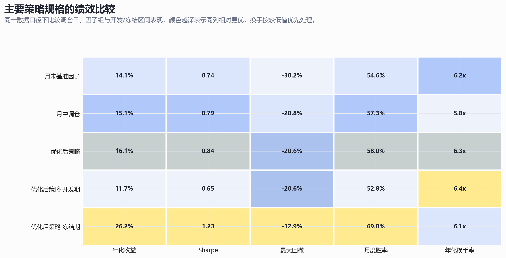

图7-2b从多维度（CAGR、Sharpe、MaxDD、Calmar、月胜率）对关键策略版本进行横向打分，补充了单一净值曲线所不能呈现的绩效全貌。Ridge收束版在收益和风险维度均优于OLS基准和LASSO版本，且在Calmar比率（年化收益/最大回撤）上优势最为突出。

### 7.2 收益来源分解

本研究最初的直觉是“用机器学习发现预测因子”。经过多轮回测和拆解后，这个策略的性质需要更精确地表述：它并不是在个股层面挖掘独立 alpha因子，也不是在任何市场状态下都能稳定获利，而更接近一个行业 beta 择时系统。

所谓行业 beta 择时，指的是策略并不完全脱离权益市场，而是在不同行业 ETF 之间调整暴露。当某些行业趋势更强、风险状态更好时，策略提高其配置概率；当整体趋势变差时，趋势过滤降低风险暴露。因此，收益来源不是“预测某只 ETF 的精确收益率”，而是判断行业状态是否延续、相对强弱是否仍然存在，以及当前是否值得承担权益风险。

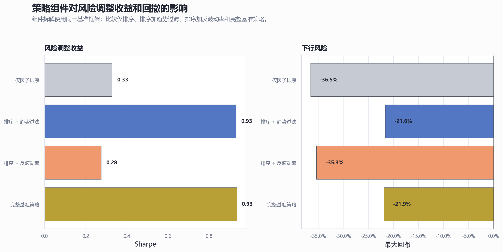

图7-3显示了在本研究主口径设定下策略组件的分解效应。单独使用因子排序时，Sharpe 约为 0.33，最大回撤约为 -36.5%；加入趋势过滤后，Sharpe 提高到约 0.93，最大回撤收窄到约 -21.6%。完整基准策略与“排序 + 趋势过滤”非常接近，提示在本设定下主要改善来自趋势过滤和风险暴露控制，而不是更复杂的仓位方案。

这并不意味着因子排序没有价值。没有排序，策略无法选择哪些行业值得持有；但排序本身不足以控制下行风险。更准确的说法是：因子排序提供方向，趋势过滤决定是否承担风险，二者共同构成策略有效性的核心。

### 7.3 市场状态依赖性

最后需要解释策略到底在什么环境中有效。由于本策略持有的是权益 ETF，它不可能完全摆脱市场状态。更合理的问题不是“它是否在所有市场中都赢”，而是“它在不同市场状态下如何获得相对优势”。

图7-5按沪深300ETF自身回撤状态进行描述性切分：大盘深回撤、大盘普通回撤，以及大盘高位或上行。这个切分不是预测模型的一部分，只用于事后解释策略收益来源。

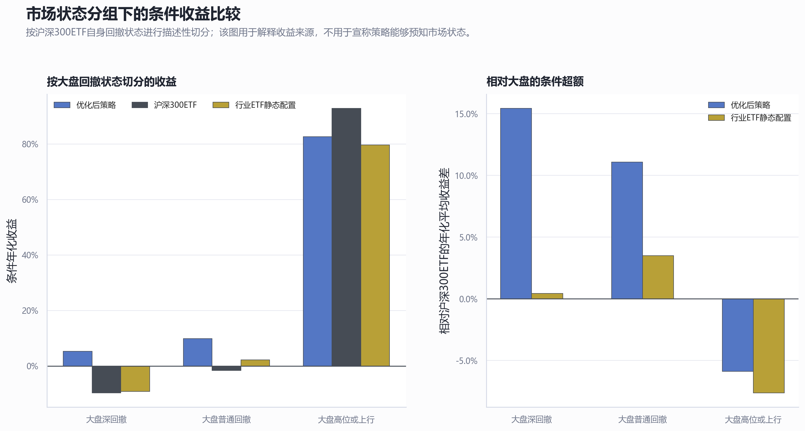

结果显示，在大盘深回撤和普通回撤状态下，优化后策略相对沪深300ETF有明显正超额；在大盘高位或上行状态下，策略的条件收益仍然较高，但相对沪深300ETF的超额转为负。这说明策略的核心价值并不是在所有上涨行情中跑赢最强的大盘暴露，而是在市场承压时通过趋势过滤和行业切换减少损失，并在可参与的上行阶段保留部分权益 beta。

这也帮助重新定义策略性质。它不是一个稳定挖掘个股 alpha 的模型，也不是市场中性套利模型；它更接近增强版行业指数轮动器，或者低频 CTA-like 的行业 beta 择时系统。机器学习在其中发挥的作用，是帮助排序、收缩、筛除冗余信号，并为规格审查提供工具，而不是单独构成主要收益来源。

---

从本研究的完整探索过程看，在本样本与设定条件下，最值得保留的不是某个单一参数，而是以下三条经验性规律。

第一，资产池不是越大越好。行业 ETF 的扩展只有在新增资产提供独立经济暴露、足够历史长度和足够流动性时才有意义。如果只是把相近主题拆得更细，模型面对的可能是更高维的小样本排序问题。

第二，因子不是越多越好。新增因子必须通过覆盖率、IC、相关性、LASSO 稳定性和回测转化能力的多重审查。全量扩展因子并不天然优于经过筛选的紧凑因子组。

第三，交易频率不是越高越好。行业轮动更接近中期状态延续，过高频率会放大噪声和交易成本。对于小资金、中低频、T+1 约束下的 ETF 配置，月频或接近月频的规则更符合策略逻辑。

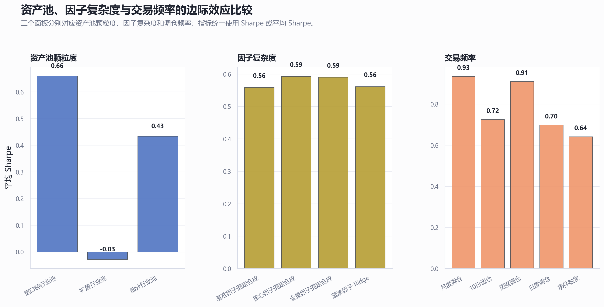

图7-6把这三条规律放在同一张图中。资产池层面，六类宽口径行业 ETF 的平均 Sharpe 高于八类扩展和十二类细分资产池；因子层面，从 5 个因子增加到 12 个或 55 个因子后，平均 Sharpe 并没有出现单调提升；交易频率层面，日频和事件触发版本弱于月频与周频，说明响应更快不等于成本后更优。

这三条规律共同指向同一个结论：本研究的核心不是不断复杂化，而是在数据、模型和交易规则之间寻找稳健的约束。机器学习帮助我们更系统地比较这些约束，但最终能否形成可交易策略，仍取决于金融问题本身的样本长度、噪声结构和执行条件。

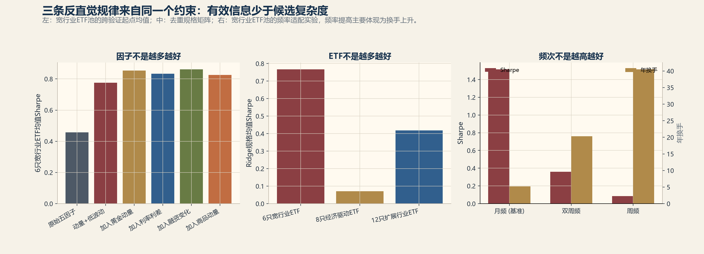

图7-7以三连图的形式将上述规律整合为统一的视觉表达：资产池层面，更少但更宽的行业覆盖更稳健；因子层面，精简后的特征集泛化能力更强；频率层面，低频规则在成本后可执行性上优于高频。这三张子图共同指向一个核心信息——在低维ETF轮动的约束下，"不是更多"比"追求更多"更可能形成可交易的策略原型。

---


## 第八部分 结论

### 8.1 核心结论

在本研究的样本与设定条件下，机器学习主要发挥三类作用：

| 作用 | 机制 | 典型应用 |
|------|------|----------|
| **排序** | 将多因子整合为横截面预测分数 | Ridge/LASSO/Elastic Net → ETF相对排序 |
| **收缩** | 惩罚系数规模或筛除变量，降低过拟合风险 | LASSO入选频率、Ridge连续收缩 |
| **审查** | 反向检查策略规格的稳定性 | CSCV/PBO、滚动起点敏感性、多墙POOS |

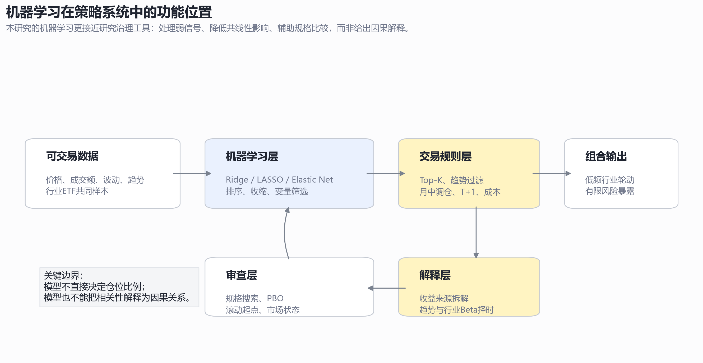

图8-1概括了这一分工：数据进入机器学习层后输出排序信号；交易规则层决定Top-K、趋势过滤、调仓日和成本约束；审查层对规格搜索和过拟合进行复核。机器学习在本研究中不是收益的唯一来源，其现实价值在于把弱信号放进一个可收缩、可比较、可审查的框架中。

### 8.2 方法论结论

在本研究的实证与审计经验下，金融市场机器学习的研究范式宜从"绝对高收益率的预测"转向"**系统化的规格治理（Specification Governance）**"。在噪声主导的环境中，模型参数收缩（L2连续收缩）与硬性逻辑约束（均线风控过滤、调仓频率限制）比试图寻找复杂非线性公式更为稳健。

### 8.3 局限与后续方向

**数据与样本局限**：本研究以公开ETF日频数据为主，未全面纳入财务预期、行业景气或文本类变量；细分行业ETF普遍上市较晚，样本长度限制了颗粒度扩张的可能性；宏观与外部变量尚未稳定转化为可交易的边际增量。

**方法局限**：当前模型为线性正则化方法，对潜在非线性关系表达能力有限，但在当前样本量下引入复杂模型并不必然更好。因子跨期稳定性和成本后转化能力仍不尽满意——策略收益更接近趋势跟踪与行业Beta择时，而非依赖某个新Alpha因子。

**审计局限**：规格分布、PBO/CSCV、滚动起点和市场状态切分等审查手段，使用的仍是已发生的历史数据，仅能说明策略未明显依赖单一脆弱规格，不能保证未来有效。更严格的下一步应建立版本冻结机制，进行真正的事前固定、事后记录检验。

**表8-1 后续工作方向**

| 方向 | 任务 | 目的 |
|------|------|------|
| 数据层 | 接入点时数据库及行业外部变量 | 降低数据偏差 |
| 因子层 | AI辅助提出并审查新因子假设 | 寻找趋势之外的边际增量 |
| 模型层 | 更大样本中测试非线性方法 | 判断复杂模型的真实贡献 |
| 执行层 | 半自动低频交易流程（模型生成→人工确认） | 提高可执行性 |
| 平台层 | 标准策略库、图表索引、版本记录 | 提升复现与审查能力 |

本研究最初的问题是：机器学习能否帮助我们在中国行业ETF中识别可交易规律。经过完整探索后，答案需要谨慎表述。

在6只宽口径ETF这一低维横截面中，机器学习能够帮助形成相对排序、压缩噪声、筛查冗余因子，并对大量策略规格进行系统审查。但机器学习并不是收益的唯一来源——当前策略更接近一个带趋势过滤的行业Beta择时系统，收益来自行业状态延续、趋势约束、低频交易纪律和可执行资产池之间的配合。

因此，本研究的结论不是"找到了一个稳定赚钱模型"，而是完成了一次从机器学习直觉到可审计策略原型的转化：把一个关于行业轮动的想法，放入数据约束、工程规则、正则化预测、回测审查和机制解释之中。这个过程本身，就是机器学习在实证金融研究中最有价值的部分。
---

## 参考文献

1. **Sharpe, W. F.** (1964). Capital asset prices: A theory of market equilibrium under conditions of risk. *The Journal of Finance*, 19(3), 425–442.

2. **Lintner, J.** (1965). Security prices, risk, and maximal gains from diversification. *The Journal of Finance*, 20(4), 587–615.

3. **Fama, E. F., & French, K. R.** (1993). Common risk factors in the returns on stocks and bonds. *Journal of Financial Economics*, 33(1), 3–56.

4. **Fama, E. F., & French, K. R.** (2015). A five-factor asset pricing model. *Journal of Financial Economics*, 116(1), 1–22.

5. **Jegadeesh, N., & Titman, S.** (1993). Returns to buying winners and selling losers: Implications for stock market efficiency. *The Journal of Finance*, 48(1), 65–91.

6. **Moskowitz, T. J., & Grinblatt, M.** (1999). Do industries explain momentum? *The Journal of Finance*, 54(4), 1249–1290.

7. **Moskowitz, T. J., Ooi, Y. H., & Pedersen, L. H.** (2012). Time series momentum. *Journal of Financial Economics*, 104(2), 228–250.

8. **Gu, S., Kelly, B., & Xiu, D.** (2020). Empirical asset pricing via machine learning. *The Review of Financial Studies*, 33(5), 2223–2273.
