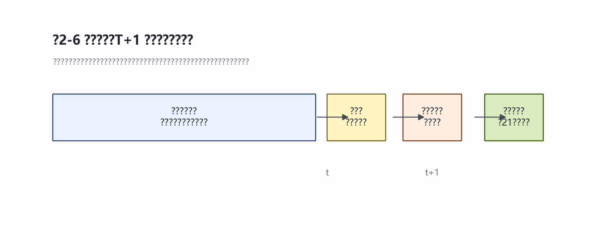



# 引言与研究问题 {#sec-intro}

## 研究背景 {#sec-background}

不同行业的市场表现并不同步。在经济环境、产业景气和资金偏好发生变化时，市场中的优势行业也会随之转换。行业轮动策略试图识别这种相对强弱变化，并将资金配置到表现更有可能延续的行业。

但行业轮动并不容易。金融数据噪声较大，行业表现也会随市场状态发生变化。单一动量指标可能遗漏风险、趋势和交易信息；使用过多指标，又容易出现信息重复和历史过拟合。

行业ETF为研究这一问题提供了较合适的对象——既能够代表不同产业，又比个股更容易交易和管理。

## 研究问题 {#sec-question}

::: {.callout-important}

**核心研究问题**：机器学习能否整合动量、趋势、风险和交易信息，改善中国行业ETF的相对排序，并形成具有一定稳定性的低频轮动策略？

:::

围绕这一问题，本文考察三个方面：

1. 行业ETF的历史表现是否包含可以利用的相对强弱和趋势信息
2. Lasso、Ridge和Elastic Net等正则化模型，是否能够比单一动量或简单因子组合更有效地整合信息
3. 在改变资产池、因子范围、训练窗口和交易规则后，策略结果是否仍然成立

## 研究思路与边界 {#sec-boundary}

本文首先梳理行业动量、趋势跟踪和机器学习资产定价的理论基础，建立行业轮动基准策略，再使用正则化模型预测下一阶段ETF的相对表现，最后通过不同样本区间、参数设定和交易成本检验策略的稳定性。

::: {.callout-tip}

**认识转变**：本研究的出发点最初是寻找有效的行业轮动因子。但在系统性探索、回测与规格审计过程中，我们发现机器学习的主要贡献并不在于发现某种市场尚未察觉的稳定盈利公式，而在于对高噪声、强共线的多因子信号进行稳健的收缩整合与排序——其角色被逐步限缩为"弱信号治理工具"而非"Alpha发现引擎"。

:::

---

# 文献基础与理论框架 {#sec-theory}

## 学术研究的演进脉络 {#sec-lineage}

### 资产定价理论的起点：CAPM

资本资产定价模型（CAPM, Sharpe 1964; Lintner 1965）认为资产的预期收益仅由其市场风险（Beta）决定：

$$
E(R_i) = R_f + \beta_i [E(R_m) - R_f]
$$

CAPM简洁优美，但实证发现其解释力有限。

### 因子模型的诞生

**Fama-French 三因子模型（1993）** 发现除市场风险外，规模因子（SMB）和价值因子（HML）能显著解释股票收益。后续拓展为五因子模型（RMW + CMA），奠定了现代因子投资的理论基础。

### 动量效应的发现

Jegadeesh & Titman（1993）发现**过去收益本身也是未来收益的预测因子**——动量效应。Moskowitz & Grinblatt（1999）进一步发现个股动量收益很大程度上来源于行业层面的持续性。

Moskowitz, Ooi & Pedersen（2012）将动量从"截面比较"拓展到"时间序列"维度，为趋势跟踪策略提供了理论依据。

### 机器学习进入资产定价

Gu, Kelly & Xiu（2020）系统比较了多种机器学习方法在资产定价中的表现，核心发现：**机器学习的主要作用是整合弱信号，而非发现新规律**。

## 动量效应的理论基础 {#sec-momentum-theory}

### 不同时间维度下的动量与反转

动量效应并非在所有时间维度上都成立：

| 时间维度 | 效应 | 主导机制 |
|----------|------|----------|
| 短期（<1月） | 反转 | 流动性冲击后的回归 |
| 中期（3-12月） | **动量最强** | 反应不足/信息扩散 |
| 长期（>2年） | 反转 | 过度反应后的均值回归 |

::: {.callout-note}

**核心洞察**：动量与反转并非矛盾，而是不同力量在不同时间尺度上的主导权切换。量化轮动的精髓在于选择3-12个月的中期趋势窗口——既避开短期交易噪音，又在长期均值回归启动前及时离场。

:::

### 截面动量与时间序列动量

- **截面动量**：关注资产之间的相对强弱，挑选综合得分最高的Top-K资产
- **时间序列动量**：关注资产自身的绝对趋势，通过180MA过滤筛除下行中的资产

两种逻辑的结合，使策略同时回答了两个问题：选择哪个行业，以及当前是否适合持有风险资产。

## 机器学习在资产定价中的角色 {#sec-ml-role}

### 为什么需要正则化方法？

在量化研究中面临的挑战：候选因子众多、因子高度相关、信噪比极低。传统OLS在多重共线性下估计量方差大、系数不稳定。

**正则化方法**通过在损失函数中加入惩罚项，牺牲一定偏差来大幅降低方差：

| 方法 | 惩罚项 | 特点 | 适用场景 |
|------|--------|------|----------|
| **Ridge** | L2（系数平方和） | 连续收缩，不归零 | 因子多且相关 |
| **LASSO** | L1（系数绝对值和） | 精确归零，自动筛选 | 识别关键因子 |
| **Elastic Net** | L1 + L2 | 兼顾收缩与筛选 | 因子分组相关 |

### 在ETF轮动中的角色定位

::: {.callout-important}

**角色定位**：本研究将机器学习定位为**多因子弱信号的收缩排序与去噪整合工具**（Signal Regularization & Ranking Tool），而非Alpha发现引擎。

:::

在学术逻辑上，策略优化的目标函数为：

$$
\max_{\text{spec}} \underbrace{\text{Sharpe}}_{\text{收益}} - \lambda \cdot \underbrace{\text{Turnover}}_{\text{成本}} - \gamma \cdot \underbrace{\text{Instability}}_{\text{不稳定性}}
$$

## 理论整合框架：弱信号治理问题 {#sec-framework}

研究框架的核心原则：

1. **从"预测问题"转向"排序问题"**：策略追求的是ETF横截面相对排序，而非精确收益率预测
2. **从"Alpha发现"转向"信号治理"**：正则化模型通过参数惩罚对高共线性、高噪因子集进行收缩治理
3. **强调低频可交易约束**：策略建立在T+1交易、15bps双边成本和月频调仓的工程约束之上

---

# 数据构建与基准策略 {#sec-data}

## 从研究问题到可操作的数据方案 {#sec-data-solution}

基准资产池选择**六只宽口径行业ETF**，覆盖消费、金融、医药、科技和能源等主要方向——在行业覆盖、历史长度和流动性之间形成可行的起点。

### 行业相对强弱的轮动特征

行业ETF的历史走势呈现出显著的轮动特征：没有任何单一行业能持续保持强势，相对强弱表现出清晰的"波段性"和"阶段切换"特征——这为行业轮动策略提供了经验基础。

## 因子构造与预测逻辑 {#sec-factor-construction}

本文从**动量、趋势和风险**三个角度构造量价因子：

### 动量因子

$$
MOM_{i,t}^{(k)} = \frac{P_{i,t}}{P_{i,t-k}} - 1
$$

回答"不同行业中谁过去表现更强"——行业价格对基本面变化的调整往往不是一次完成的。

### 趋势因子

$$
TREND_{i,t}^{(k)} = \frac{P_{i,t}}{MA_{i,t}^{(k)}} - 1
$$

动量和趋势并不相同：动量比较行业间的相对强弱，趋势判断ETF自身是否仍处于上升环境。

### 为什么需要正则化模型

因子之间高度相关（如126日动量与252日动量相关系数>0.82），五个因子实际提供的独立信息维度少于五个。正则化方法的作用是对这些相关信息进行收缩、筛选和组合。

## 基准模型与交易流程 {#sec-baseline-pipeline}

模型在统计上预测ETF下一持有期收益率：

$$
\widehat{R}_{i,t+1} = \widehat{\alpha}_t + X_{i,t}'\widehat{\beta}_t
$$

策略使用预测收益形成的**相对排名**进行配置决策。

### 基准策略设定

| 模块 | 基准设定 | 选择依据 | 可能的局限 |
|------|----------|----------|------------|
| 资产池 | 宽口径行业ETF | 历史较长、行业含义清楚 | 行业覆盖不够细 |
| 因子 | 动量、趋势、低波动 | 数据可得、理论明确 | 基本面信息不足 |
| 模型 | 正则化线性模型 | 小样本、因子相关 | 难以刻画非线性 |
| 训练 | 滚动窗口 | 允许权重随时间变化 | 窗口长度需检验 |
| 调仓 | 月频 | 降低换手与成本 | 可能错过快速变化 |
| 趋势过滤 | 长期均线 | 控制系统性下跌风险 | 参数存在经验性 |
| 执行 | T+1、含成本 | 避免未来信息 | 成本仍为近似值 |

## 基准结果与第一轮反思 {#sec-baseline-reflection}

基准版本在历史样本中表现出一定优势，但不能直接证明机器学习已经发现了稳定规律。基准策略的作用是建立一个能够被拆解和检验的研究对象。

---

# 机器学习排序模型（核心方法） {#sec-core-method}

## 模型定位：弱信号治理而非预测模型 {#sec-model-position}

模型在本研究中的角色被重新定义为：**对高噪声、强共线的多因子信号进行稳健收缩与整合，输出相对排序分数，而非精确收益预测**。

约束原则：
- 模型不需要很复杂——正则化线性模型足够
- 模型不需要解释因果关系——只需给出稳定排序
- 选择标准不是样本内拟合——而是样本外排序一致性

## 正则化排序模型 {#sec-regularization-models}

三种方法的核心差异：

- **Ridge**："谁也不许太大"——对所有系数施加平滑收缩，结果更保守但也更稳定
- **LASSO**："不够好的就剔除"——允许部分系数精确归零，天然具有变量筛选功能
- **Elastic Net**：两者结合，既收缩又筛选

::: {.callout-note}

三种方法之间的差异在实际回测中并没有大到可以单独解释策略收益的程度——正则化方法本身不是Alpha的来源，而是信号整合的工具。

:::

## 训练框架设计 {#sec-training-framework}

### 滚动窗口 vs 拓展窗口

| 框架 | 机制 | 优势 | 劣势 |
|------|------|------|------|
| **滚动窗口** | 固定长度，随时间滑动 | 适应区制转移 | 估计方差较大 |
| **拓展窗口** | 固定起点，持续累积 | 渐近一致，方差降低 | 陈旧数据引入偏差 |

### 数据禁运区（Embargo Zone）

在训练集与预测时点之间设计了严格的**21天禁运区**，杜绝重叠样本导致的前瞻信息泄露。

### 训练窗口长度的实证对比

| 训练窗口 | CAGR | Sharpe | Max DD | 年换手率 |
|----------|------|--------|--------|----------|
| 滚动 1月 | 3.51% | 0.43 | -18.67% | 5.13x |
| 滚动 3月 | 14.36% | 0.73 | -28.09% | 8.93x |
| **滚动 24月** | **14.59%** | **0.75** | **-28.28%** | **9.19x** |
| 滚动 96月 | 14.10% | 0.82 | -24.05% | 4.31x |
| 拓展窗口 | 11.19% | 0.64 | -27.45% | 5.96x |

::: {.callout-tip}

**学理抉择**：将**滚动24个月**锁定为主口径。96月窗口虽有更高Sharpe，但超长估计窗口与A股明显的经济区制转移相违背，且对新成立ETF存在幸存者偏差。

:::

---

# 策略的优化探索 {#sec-optimization}

## 策略规格空间与双阶段探索设计 {#sec-spec-space}

策略规格空间由三个核心层级构成：

1. **信息源控制层**：6-22只ETF、5-27个候选因子
2. **估计稳定性控制层**：OLS/Ridge/LASSO/Elastic Net、滚动12m-96m及拓展窗口
3. **执行与摩擦控制层**：无过滤/150MA/180MA/200MA、月频/双周频/周频

## 策略要素探索与审计治理 {#sec-element-exploration}

### 5.2.1 资产池颗粒度对比

锁定**6只宽口径行业ETF**——覆盖消费、医药、科技、金融、能源、军工六大方向，具有经济含义清楚、相关性适中、历史长度充足的核心优势。

### 5.2.2 特征精简与共线性收缩对比

从27个候选因子 → 11个精简 → 5个基准因子的筛选漏斗。

### 5.2.3 趋势过滤防御规则对比

| 过滤规则 | Sharpe | Max DD |
|----------|--------|--------|
| 无过滤 | 0.33 | -36.5% |
| 200MA | 0.62 | -25.3% |
| **180MA** | **0.75** | **-28.3%** |

### 5.2.4 调仓频率对比

月频调仓在中低频ETF轮动中表现最优——过高频率会放大噪声和交易成本。

### 5.2.5 探索中放弃的方向 {#sec-abandoned}

::: {.callout-important}

**（1）崩盘保护规则**：Sharpe从0.79降至0.48，最大回撤从-21.9%恶化至-39.7%。仓位二元切换在A股高波动环境中容易产生"反复打脸"效应。

**（2）低位抄底/反转策略**：跨六墙均值Sharpe仅0.14（等权版），IC均值为负。行业趋势一旦形成持续数月，反转信号缺乏足够预测提前量。

**（3）风险覆盖层**：成交额拥挤降权改善微弱（+0.015 Sharpe），波动率目标牺牲收益换取回撤压缩——收益的牺牲远大于回撤改善。

:::

::: {.callout-tip}

**共同教训**：在低维、中低频的ETF轮动框架下，简单规则比复杂叠加更可靠。额外的防御层往往在消灭尾部风险的同时也消灭了收益。

:::

## 规格收敛与最终参数锁定 {#sec-convergence}

最终锁定的主口径参数：

| 参数 | 锁定值 |
|------|--------|
| 资产池 | 6只宽口径行业ETF |
| 模型 | Ridge连续收缩 |
| 训练窗口 | 滚动24个月 + 21天禁运区 |
| 趋势过滤 | 180MA中期均线 |
| 调仓 | 月中月频 |
| 成本 | 双边15bp |

---

# 过拟合风险与稳健性审计 {#sec-robustness}

## 评价起点敏感性审计 {#sec-start-sensitivity}

在15个不同评价起点下，Ridge策略的Sharpe均稳定高于沪深300ETF和6-ETF静态等权配置——策略优势不依赖于特定时点的幸运切分。

## 概率过拟合审计（PBO & CSCV） {#sec-pbo}

### 设定曲线分析（SCA）

在84组去重规格空间上的SCA诊断：
- Sharpe中位数：0.53
- 90%分位数：0.86
- 仅4.8%的规格Sharpe低于0

### CSCV过拟合概率

::: {.callout-important}

若允许在18组较大网格中无节制挑选"Sharpe冠军"，CSCV审计计算的PBO高达**64.3%**——未经规则收束的规格搜索有极大可能过拟合崩溃。

:::

## 多"墙"伪样本外（POOS）稳健性检验 {#sec-poos}

5个历史"墙"截面（2018-2022年各年末），策略墙后平均Sharpe达0.92（分布0.76-1.12），均稳定跑赢基准。

---

# 实证结果与经济解释 {#sec-results}

## 基准 vs ML策略对比 {#sec-comparison}

| 指标 | 沪深300ETF | 行业静态配置 | **优化策略** |
|------|-----------|-------------|-------------|
| 期末累计净值 | 1.43 | 1.72 | **2.75** |
| CAGR | 6.13% | — | **14.59%** |
| Sharpe | 0.41 | — | **0.75** |
| Max DD | -42.2% | -27.3% | **-27.5%** |

策略相对沪深300ETF累计超额102%，相对行业静态配置累计超额59%。

## 收益来源分解 {#sec-decomposition}

策略更接近**行业Beta择时系统**：
- **因子排序提供方向**：判断哪些行业值得持有
- **趋势过滤决定风险**：判断是否值得承担权益风险
- 二者共同构成策略有效性的核心

| 组件组合 | Sharpe | Max DD |
|----------|--------|--------|
| 仅因子排序 | 0.33 | -36.5% |
| 排序 + 趋势过滤 | **0.93** | **-21.6%** |
| 完整策略 | 0.75 | -27.5% |

## 市场状态依赖性 {#sec-regime}

策略的核心价值不在于在所有上涨行情中跑赢大盘，而在于：
- 市场承压时通过趋势过滤和行业切换**减少损失**
- 可参与的上行阶段**保留部分权益Beta**

## 三条经验性规律 {#sec-three-lessons}

1. **资产池不是越大越好**：六类宽口径ETF平均Sharpe高于八类和十二类
2. **因子不是越多越好**：从5→55个因子，平均Sharpe无单调提升
3. **交易频率不是越高越好**：日频弱于月频和周频

---

# 结论 {#sec-conclusion}

## 核心结论 {#sec-core-conclusion}

机器学习在本研究中发挥三类作用：

1. **排序**：将多个因子整合为相对收益预测分数
2. **收缩**：通过惩罚项降低过拟合历史噪声的风险
3. **审查**：LASSO入选频率、CSCV/PBO、滚动起点敏感性等

::: {.callout-important}

**最终结论**：机器学习并不是收益的唯一来源，更不是结构发现和因果解释工具。它的更现实价值，是把弱信号放进一个可收缩、可比较、可审查的框架中。当前策略更接近一个**带趋势过滤的行业Beta择时系统**——收益来自行业状态延续、趋势约束、低频交易纪律和可执行资产池之间的配合。

:::

## 方法论结论 {#sec-method-conclusion}

金融市场机器学习的研究范式应从"绝对高收益率的预测"转向**"系统化的规格治理（Specification Governance）"**。在噪声主导的环境中，模型参数收缩和硬性逻辑约束比寻找神奇非线性Alpha公式有效得多。

## 局限与扩展 {#sec-limitations}

| 方向 | 具体任务 | 目的 |
|------|----------|------|
| 数据层 | 接入点时数据库和更稳定的行业外部变量 | 降低数据修订与覆盖偏差 |
| 因子层 | 使用AI辅助提出并审查新因子假设 | 寻找趋势之外的边际Alpha |
| 模型层 | 在更大样本中测试非线性模型 | 判断复杂模型是否有真实增量 |
| 执行层 | 建立邮件提醒与人工确认的低频交易流程 | 提高策略可执行性 |
| 平台层 | 清理探索代码，建立策略库和图表索引 | 提升复现、审查和维护能力 |

---

**本研究完成了一次从机器学习直觉到可审计策略原型的转化：把一个关于行业轮动的想法，放入数据约束、工程规则、正则化预测、回测审查和机制解释之中。这个过程本身，就是机器学习在实证金融研究中最有价值的部分。**
