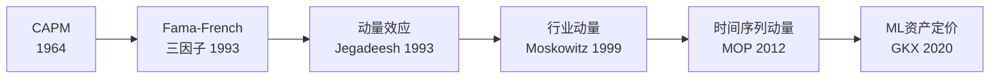
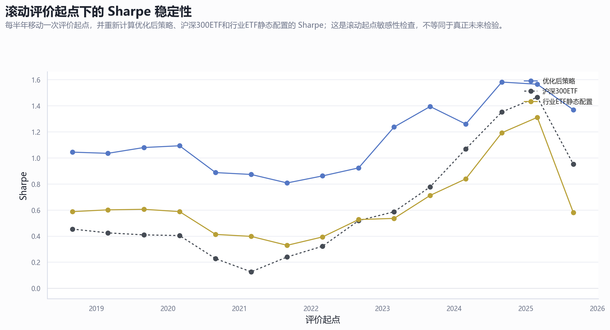

# 机器学习辅助的中国行业ETF轮动
## 弱信号治理与规格审计框架下的实证分析

**量化金融研究组**  
2026年6月26日

---

# 研究动机

::: {.block}
## 核心问题
**机器学习能否整合动量、趋势、风险和交易信息，改善中国行业ETF的相对排序？**
:::

. . .

- 行业轮动理论上可行，但现实中面临三大挑战
- 金融数据噪声大 → 单一指标不可靠
- 因子高度相关 → 直接OLS系数不稳定
- 样本有限 → 复杂模型容易过拟合

---

# 研究定位：从"Alpha发现"到"信号治理"

::: {.block}
## 关键认识转变
机器学习的主要贡献**不在于发现市场尚未察觉的稳定盈利公式**，而在于对高噪声、强共线的多因子信号进行**稳健的收缩整合与排序**。
:::

. . .

$$
\max_{\text{spec}} \underbrace{\text{Sharpe}}_{\text{收益}} - \lambda \cdot \underbrace{\text{Turnover}}_{\text{成本}} - \gamma \cdot \underbrace{\text{Instability}}_{\text{不稳定性}}
$$

---

# 理论演进脉络

. . .

- **CAPM → Fama-French**：从单一风险到多因子范式
- **动量效应**：过去收益本身也是预测因子
- **行业动量**：个股动量很大程度上源于行业持续性
- **ML资产定价**：机器学习的主要作用是**整合弱信号**

---

# 不同时间维度下的动量与反转

| 时间维度 | 效应 | 主导机制 |
|----------|------|----------|
| **短期（<1月）** | 反转 | 流动性冲击后的回归 |
| **中期（3-12月）** | **动量最强** ⭐ | 反应不足/信息扩散 |
| **长期（>2年）** | 反转 | 过度反应后的均值回归 |

. . .

::: {.block}
**策略核心**：选择3-12个月中期趋势窗口——避开短期噪音，在均值回归前离场
:::

---

# 正则化方法：三种收缩策略

---

# 正则化方法对比

| 方法 | 惩罚项 | 特点 | ETF轮动角色 |
|------|--------|------|-------------|
| **Ridge** | L2 | 连续收缩，不归零 | 稳定排序 |
| **LASSO** | L1 | 精确归零，自动筛选 | 因子识别 |
| **Elastic Net** | L1+L2 | 兼顾收缩与筛选 | 折中方案 |

. . .

::: {.block}
**核心发现**：三种方法差异不足以单独解释策略收益——正则化是工具而非Alpha来源
:::

---

# 数据方案：6只宽口径行业ETF

---

# ETF上市时间线

. . .

- 宽口径ETF（2013-2015年上市）→ 共同样本充足
- 细分行业ETF（2019年后上市）→ 可用历史较短
- **客观约束**：过于细分的资产池压缩共同回测区间

---

# 行业轮动确实存在

. . .

- 没有任何行业能持续保持第一名
- 相对强弱呈现**几个月至一年不等**的中期趋势迁移
- 为月频轮动策略提供经验支撑

---

# 截面动量 vs 时间序列动量

. . .

- **截面动量**：谁相对更强？→ Top-K选择
- **时间序列动量**：是否还值得持有？→ 180MA过滤
- 两套逻辑互补，缺一不可

---

# 基准策略架构

---

# 基准策略设定

| 模块 | 基准设定 | 核心理由 |
|------|----------|----------|
| 资产池 | 6只宽口径ETF | 历史长、流动性好 |
| 因子 | 动量+趋势+风险 | 公开可得、理论明确 |
| 模型 | 正则化线性 | 小样本、因子相关 |
| 训练 | 滚动24月+禁运21天 | 防前瞻泄露 |
| 调仓 | 月频T+1 | 降低换手与成本 |
| 过滤 | 180MA | 控制下行风险 |

---

# 基准结果

. . .

- 基准策略表现出超额——但不能证明已发现稳定规律
- 需要进一步拆解：收益来自排序、过滤还是两者组合？

---

# 模型定位：弱信号治理

::: {.block}
## 从"预测"到"排序"
模型任务不是精确预测收益率，而是对6只ETF进行**稳定横截面排序**

机器学习 = **Signal Regularization & Ranking Tool**
:::

. . .

三个约束原则：
1. 模型不需要复杂——线性正则化足够
2. 模型不解释因果——只需稳定排序
3. 选择标准不是样本内拟合——而是**样本外排序一致性**

---

# 训练框架：严防前瞻信息

. . .

- **滚动窗口 vs 拓展窗口** = 偏差-方差折中
- **21天禁运区** = 训练集标签截止日 < 调仓日 - 21天
- 杜绝重叠样本导致的虚高回测绩效

---

# 训练窗口实证对比

| 训练窗口 | CAGR | Sharpe | Max DD |
|----------|------|--------|--------|
| 滚动 1月 | 3.51% | 0.43 | -18.67% |
| 滚动 24月 ⭐ | **14.59%** | **0.75** | **-28.28%** |
| 滚动 96月 | 14.10% | 0.82 | -24.05% |
| 拓展窗口 | 11.19% | 0.64 | -27.45% |

. . .

::: {.block}
**学理抉择**：锁定**滚动24月**为主口径——理论合规、绩效优异、避免幸存者偏差
:::

---

# 策略规格空间：三个控制层

---

# 规格探索总览

| 维度 | 探索范围 | 最终锁定 |
|------|----------|----------|
| 资产池 | 6 / 16 / 22只ETF | **6只** |
| 因子 | 5 / 11 / 27个 | **5个基准** |
| 趋势过滤 | 无 / 150MA / 180MA / 200MA | **180MA** |
| 调仓频率 | 日 / 周 / 双周 / 月 | **月频** |

---

# 资产池：扩容≠更优

. . .

- 8-ETF版Sharpe下降→新增覆盖边缘行业，稀释动量浓度
- 技术轮动尝试：高弹性但高波动，月频调仓下信息衰减过快
- **结论**：6只宽口径是最具统计可靠性的选择

---

# 因子筛选：5因子 vs 2因子

. . .

- 27个候选 → 11个 > 80%覆盖率 → **5个基准因子**
- LASSO稳定性验证：5因子的入选频率远高于其余候选
- gap_return_20 增强因子：单因子IC达0.041，但跨墙稳定性不及基准

---

# 趋势过滤：180MA vs 200MA

---

# 趋势过滤效果

| 过滤规则 | Sharpe | Max DD | 空仓占比 |
|----------|--------|--------|----------|
| 无过滤 | 0.33 | -36.5% | 0% |
| 200MA | 0.62 | -25.3% | ~25% |
| **180MA** ⭐ | **0.75** | **-28.3%** | **~36%** |

. . .

- 180MA在2022-2024熊市中触发更及时的空仓
- 更高的空仓占比并未损害Sharpe——"宁可错过，不可做错"

---

# 调仓频率：月频最优

. . .

- 行业轮动是中期趋势延续问题，不是高频博弈
- 过高频率 → 噪声放大 + 成本侵蚀
- 月频在信号时效性和交易成本间达到最佳平衡

---

# 放弃的方向（1）：崩盘保护

. . .

- Sharpe 0.79 → 0.48，MaxDD -21.9% → -39.7%
- V型反弹被误判为崩盘 → "反复打脸"
- **教训**：二元切换不如连续均线平滑

---

# 放弃的方向（2）：抄底反转

. . .

- 7个反转因子，跨六墙均值Sharpe仅0.14
- IC均值为负 → 反转信号缺乏预测提前量
- **教训**：行业趋势持续数月，反转策略在月频下无效

---

# 放弃的方向（3）：风险覆盖

. . .

- 成交额拥挤降权：Sharpe改善仅+0.015
- 波动率目标：回撤↓但收益↓更多（7.7%→5.6%）
- **教训**：防御层消灭尾部风险的同时也消灭了收益

---

# 三条经验规律

::: {.block}
1. **资产池不是越大越好** → 宽口径ETF平均Sharpe最高
2. **因子不是越多越好** → 5→55因子无单调改善
3. **频率不是越高越好** → 日频弱于月频和周频
:::

---

# 规格收敛全景

---

# 最终锁定参数

::: {.block}
## 主口径策略规格

| 参数 | 锁定值 |
|------|--------|
| 资产池 | 6只宽口径行业ETF |
| 模型 | Ridge连续收缩 |
| 训练窗口 | 滚动24个月 + 21天禁运区 |
| 趋势过滤 | 180MA中期均线 |
| 调仓 | 月中月频，T+1执行 |
| 成本 | 双边15bp |
:::

---

# 过拟合风险审计

## PBO = 64.3%

若允许无节制网格搜索挑"Sharpe冠军"→ **64.3%概率样本外崩溃**

. . .

. . .

- 84组去重规格Sharpe中位数0.53，90%分位0.86
- **结论**：规格收敛不是可选项，是必须的学术防火墙

---

# 评价起点敏感性

. . .

- 15个不同起点下，策略Sharpe**始终**高于基准
- 不依赖特定时点的幸运切分

---

# 多墙伪样本外（POOS）检验

. . .

- 5个历史"墙"截面（2018-2022）
- 墙后平均Sharpe **0.92**（分布0.76-1.12）
- 均稳定跑赢同期沪深300和静态等权基准

---

# 不同进入时点的投资者体验

. . .

- 净值曲线形态高度一致 → 策略逻辑稳健
- 绝对收益受进入时点影响 → 权益策略无法免疫
- **无"永久不恢复"的脆弱路径** → 最不利时点也能修复

---

# 最终绩效

---

# 绩效数据

| 指标 | 沪深300ETF | 行业静态 | **优化策略** |
|------|-----------|---------|-------------|
| 累计净值 | 1.43 | 1.72 | **2.75** |
| CAGR | 6.13% | — | **14.59%** |
| Sharpe | 0.41 | — | **0.75** |
| Max DD | -42.2% | -27.3% | **-27.5%** |

. . .

- 相对沪深300ETF累计超额：**+102%**
- 相对行业静态配置累计超额：**+59%**

---

# 收益来源分解

---

# 收益来源：行业Beta择时

| 组件 | Sharpe | Max DD |
|------|--------|--------|
| 仅排序 | 0.33 | -36.5% |
| 排序+过滤 | **0.93** | **-21.6%** |

. . .

::: {.block}
**策略定位**：**行业Beta择时系统**
- 因子排序 → 提供方向
- 趋势过滤 → 控制风险
- 机器学习 → 信号整合工具
:::

---

# 市场状态依赖性

. . .

- 大盘深回撤时：策略有显著正超额
- 大盘高位上行时：超额转负
- **策略价值**：下跌时减少损失 > 上涨时跑赢最强Beta

---

# 机器学习的三重角色

::: {.block}
1. **排序**：多因子整合为横截面相对排序
2. **收缩**：正则化降低过拟合风险
3. **审查**：规格搜索审计、过拟合诊断
:::

---

# 核心结论

::: {.block}
## 本研究不是"找到了稳定赚钱模型"
## 而是完成了一次从机器学习直觉到**可审计策略原型**的转化
:::

. . .

- 机器学习 ≠ Alpha发现引擎
- 机器学习 = 弱信号治理 + 规格审查工具
- 策略本质 = **带趋势过滤的行业Beta择时系统**
- 收益来源 = 行业状态延续 + 趋势约束 + 低频纪律

---

# 方法论启示

::: {.block}
## 从"预测高收益"转向"规格治理"

**Specification Governance > Alpha Hunting**
:::

. . .

在噪声主导的金融环境中：
- L2连续收缩 > 神奇非线性Alpha公式
- 硬性逻辑约束（均线、频率）> 复杂黑箱
- 系统化审计（PBO/CSCV/POOS）> 单次最优回测

---

# 局限与后续方向

| 方向 | 任务 |
|------|------|
| 📊 数据 | 接入点时数据库、行业外部变量 |
| 🔬 因子 | AI辅助提出可检验的新因子假设 |
| 🤖 模型 | 在更大样本中测试非线性方法 |
| ⚙️ 执行 | 半自动低频交易流程（邮件+人工确认） |
| 📁 平台 | 标准策略库、图表索引、版本记录 |

---

# 感谢聆听

::: {.block}
## 机器学习辅助的中国行业ETF轮动研究

**核心洞见**：在小样本、高噪声、强共线的金融场景中，  
机器学习的价值不在于发现复杂规律，  
而在于把弱信号放进一个**可收缩、可比较、可审查**的框架。
:::

. . .

📧 联系方式 | 📊 完整报告见 `final_report.html` | 🔬 代码与数据见项目仓库
